This document describes the flow of adding a new <SwmToken path="COUSR01C/COUSR01C.cbl" pos="5:13:15" line-data="      * Function    : Add a new Regular/Admin user to USRSEC file">`Regular/Admin`</SwmToken> user to the USRSEC file in the <SwmToken path="COUSR01C/COUSR01C.cbl" pos="3:7:7" line-data="      * Application : CardDemo">`CardDemo`</SwmToken> application. The process is handled by the <SwmToken path="COUSR01C/COUSR01C.cbl" pos="2:7:7" line-data="      * Program     : COUSR01C.CBL">`COUSR01C`</SwmToken> program, which ensures that the user addition is performed correctly by initializing necessary flags, checking communication area lengths, and handling user inputs appropriately.

For instance, when a user attempts to add a new admin user, the program will display the 'Add User' screen, capture the input, and process it to update the USRSEC file accordingly.

# Main user addition section (<SwmToken path="COUSR01C/COUSR01C.cbl" pos="71:1:3" line-data="       MAIN-PARA.">`MAIN-PARA`</SwmToken>)

Lets' zoom into the program flow:

```mermaid
graph TD
  A[Initialize Error Flag and Message] --> B{Check EIBCALEN}
  B -- EIBCALEN = 0 --> C[Set Program to COSGN00C]
  C --> D[Return to Previous Screen]
  B -- EIBCALEN > 0 --> E[Move DFHCOMMAREA to CARDDEMO-COMMAREA]
  E --> F{Check CDEMO-PGM-REENTER}
  F -- Not Re-entered --> G[Set Re-enter Flag]
  G --> H[Initialize COUSR1AO and FNAMEL]
  H --> I[Send Add User Screen]
  F -- Re-entered --> J[Receive Add User Screen]
  J --> K{Evaluate EIBAID}
  K -- DFHENTER --> L[Process Enter Key]
  K -- DFHPF3 --> M[Set Program to COADM01C]
  M --> N[Return to Previous Screen]
  K -- DFHPF4 --> O[Clear Current Screen]
  K -- Other --> P[Set Error Flag]
  P --> Q[Set Error Message]
  Q --> R[Send Add User Screen]

%% Swimm:
%% graph TD
%%   A[Initialize Error Flag and Message] --> B{Check EIBCALEN}
%%   B -- EIBCALEN = 0 --> C[Set Program to <SwmToken path="COUSR01C/COUSR01C.cbl" pos="79:4:4" line-data="               MOVE &#39;COSGN00C&#39; TO CDEMO-TO-PROGRAM">`COSGN00C`</SwmToken>]
%%   C --> D[Return to Previous Screen]
%%   B -- EIBCALEN > 0 --> E[Move DFHCOMMAREA to <SwmToken path="COUSR01C/COUSR01C.cbl" pos="82:12:14" line-data="               MOVE DFHCOMMAREA(1:EIBCALEN) TO CARDDEMO-COMMAREA">`CARDDEMO-COMMAREA`</SwmToken>]
%%   E --> F{Check <SwmToken path="COUSR01C/COUSR01C.cbl" pos="83:5:9" line-data="               IF NOT CDEMO-PGM-REENTER">`CDEMO-PGM-REENTER`</SwmToken>}
%%   F -- Not Re-entered --> G[Set Re-enter Flag]
%%   G --> H[Initialize <SwmToken path="COUSR01C/COUSR01C.cbl" pos="76:5:5" line-data="                          ERRMSGO OF COUSR1AO">`COUSR1AO`</SwmToken> and FNAMEL]
%%   H --> I[Send Add User Screen]
%%   F -- Re-entered --> J[Receive Add User Screen]
%%   J --> K{Evaluate EIBAID}
%%   K -- DFHENTER --> L[Process Enter Key]
%%   K -- <SwmToken path="COUSR01C/COUSR01C.cbl" pos="93:3:3" line-data="                       WHEN DFHPF3">`DFHPF3`</SwmToken> --> M[Set Program to <SwmToken path="COUSR01C/COUSR01C.cbl" pos="94:4:4" line-data="                           MOVE &#39;COADM01C&#39; TO CDEMO-TO-PROGRAM">`COADM01C`</SwmToken>]
%%   M --> N[Return to Previous Screen]
%%   K -- <SwmToken path="COUSR01C/COUSR01C.cbl" pos="96:3:3" line-data="                       WHEN DFHPF4">`DFHPF4`</SwmToken> --> O[Clear Current Screen]
%%   K -- Other --> P[Set Error Flag]
%%   P --> Q[Set Error Message]
%%   Q --> R[Send Add User Screen]
```



<SwmSnippet path="/COUSR01C/COUSR01C.cbl" line="71">

---

### Initializing Error Flag and Message

Going into the first snippet, the code initializes the error flag and clears any existing messages. This ensures that the process starts with a clean state, free of any previous errors or messages.

```cobol
       MAIN-PARA.

           SET ERR-FLG-OFF TO TRUE

           MOVE SPACES TO WS-MESSAGE
                          ERRMSGO OF COUSR1AO
```

---

</SwmSnippet>

<SwmSnippet path="/COUSR01C/COUSR01C.cbl" line="78">

---

### Checking EIBCALEN

Next, the code checks if the communication area length is zero. If it is, the program sets the next program to a specific value and returns to the previous screen. This condition handles the scenario where no communication area length is provided, redirecting the flow accordingly.

```cobol
           IF EIBCALEN = 0
               MOVE 'COSGN00C' TO CDEMO-TO-PROGRAM
               PERFORM RETURN-TO-PREV-SCREEN
```

---

</SwmSnippet>

<SwmSnippet path="/COUSR01C/COUSR01C.cbl" line="81">

---

### Handling Non-Zero EIBCALEN

Then, if the communication area length is not zero, the code moves the communication area to a specific area. If the program has not re-entered, it sets the re-enter flag, initializes certain fields, and sends the 'Add User' screen. This part of the code prepares the necessary data and displays the user addition interface.

```cobol
           ELSE
               MOVE DFHCOMMAREA(1:EIBCALEN) TO CARDDEMO-COMMAREA
               IF NOT CDEMO-PGM-REENTER
                   SET CDEMO-PGM-REENTER    TO TRUE
                   MOVE LOW-VALUES          TO COUSR1AO
                   MOVE -1       TO FNAMEL OF COUSR1AI
                   PERFORM SEND-USRADD-SCREEN
```

---

</SwmSnippet>

<SwmSnippet path="/COUSR01C/COUSR01C.cbl" line="88">

---

### Evaluating User Input

Moving to the final snippet, the code evaluates the user input. Depending on the input, it either processes the enter key, sets the next program to a specific value and returns to the previous screen, clears the current screen, or sets an error flag and message before sending the 'Add User' screen again. This ensures that the appropriate action is taken based on the user's input.

```cobol
               ELSE
                   PERFORM RECEIVE-USRADD-SCREEN
                   EVALUATE EIBAID
                       WHEN DFHENTER
                           PERFORM PROCESS-ENTER-KEY
                       WHEN DFHPF3
                           MOVE 'COADM01C' TO CDEMO-TO-PROGRAM
                           PERFORM RETURN-TO-PREV-SCREEN
                       WHEN DFHPF4
                           PERFORM CLEAR-CURRENT-SCREEN
                       WHEN OTHER
                           MOVE 'Y'                       TO WS-ERR-FLG
                           MOVE -1       TO FNAMEL OF COUSR1AI
                           MOVE CCDA-MSG-INVALID-KEY      TO WS-MESSAGE
                           PERFORM SEND-USRADD-SCREEN
                   END-EVALUATE
               END-IF
```

---

</SwmSnippet>

# Program Control Transfer (<SwmToken path="COUSR01C/COUSR01C.cbl" pos="80:3:9" line-data="               PERFORM RETURN-TO-PREV-SCREEN">`RETURN-TO-PREV-SCREEN`</SwmToken>)

<SwmSnippet path="/COUSR01C/COUSR01C.cbl" line="165">

---

Going into the first snippet, the code checks if <SwmToken path="COUSR01C/COUSR01C.cbl" pos="167:3:7" line-data="           IF CDEMO-TO-PROGRAM = LOW-VALUES OR SPACES">`CDEMO-TO-PROGRAM`</SwmToken> (the target program identifier) is either uninitialized or blank. If it is, it sets <SwmToken path="COUSR01C/COUSR01C.cbl" pos="167:3:7" line-data="           IF CDEMO-TO-PROGRAM = LOW-VALUES OR SPACES">`CDEMO-TO-PROGRAM`</SwmToken> to <SwmToken path="COUSR01C/COUSR01C.cbl" pos="168:4:4" line-data="               MOVE &#39;COSGN00C&#39; TO CDEMO-TO-PROGRAM">`COSGN00C`</SwmToken>, ensuring that there is always a valid target program to return to.

```cobol
       RETURN-TO-PREV-SCREEN.

           IF CDEMO-TO-PROGRAM = LOW-VALUES OR SPACES
               MOVE 'COSGN00C' TO CDEMO-TO-PROGRAM
           END-IF
```

---

</SwmSnippet>

<SwmSnippet path="/COUSR01C/COUSR01C.cbl" line="170">

---

Next, the second snippet moves the current transaction ID and program name into <SwmToken path="COUSR01C/COUSR01C.cbl" pos="170:9:13" line-data="           MOVE WS-TRANID    TO CDEMO-FROM-TRANID">`CDEMO-FROM-TRANID`</SwmToken> and <SwmToken path="COUSR01C/COUSR01C.cbl" pos="171:9:13" line-data="           MOVE WS-PGMNAME   TO CDEMO-FROM-PROGRAM">`CDEMO-FROM-PROGRAM`</SwmToken> respectively. It then clears the program context by setting <SwmToken path="COUSR01C/COUSR01C.cbl" pos="174:7:11" line-data="           MOVE ZEROS        TO CDEMO-PGM-CONTEXT">`CDEMO-PGM-CONTEXT`</SwmToken> to zeros. Finally, it transfers control to the program specified in <SwmToken path="COUSR01C/COUSR01C.cbl" pos="176:5:9" line-data="               XCTL PROGRAM(CDEMO-TO-PROGRAM)">`CDEMO-TO-PROGRAM`</SwmToken> using the <SwmToken path="COUSR01C/COUSR01C.cbl" pos="176:1:1" line-data="               XCTL PROGRAM(CDEMO-TO-PROGRAM)">`XCTL`</SwmToken> command, passing along the communication area <SwmToken path="COUSR01C/COUSR01C.cbl" pos="177:3:5" line-data="               COMMAREA(CARDDEMO-COMMAREA)">`CARDDEMO-COMMAREA`</SwmToken>.

```cobol
           MOVE WS-TRANID    TO CDEMO-FROM-TRANID
           MOVE WS-PGMNAME   TO CDEMO-FROM-PROGRAM
      *    MOVE WS-USER-ID   TO CDEMO-USER-ID
      *    MOVE SEC-USR-TYPE TO CDEMO-USER-TYPE
           MOVE ZEROS        TO CDEMO-PGM-CONTEXT
           EXEC CICS
               XCTL PROGRAM(CDEMO-TO-PROGRAM)
               COMMAREA(CARDDEMO-COMMAREA)
           END-EXEC.
```

---

</SwmSnippet>

# Display 'Add User' Screen (<SwmToken path="COUSR01C/COUSR01C.cbl" pos="87:3:7" line-data="                   PERFORM SEND-USRADD-SCREEN">`SEND-USRADD-SCREEN`</SwmToken>)

<SwmSnippet path="/COUSR01C/COUSR01C.cbl" line="184">

---

### Populating header information

Going into the <SwmToken path="COUSR01C/COUSR01C.cbl" pos="184:1:5" line-data="       SEND-USRADD-SCREEN.">`SEND-USRADD-SCREEN`</SwmToken> function, the first step is to perform the <SwmToken path="COUSR01C/COUSR01C.cbl" pos="186:3:7" line-data="           PERFORM POPULATE-HEADER-INFO">`POPULATE-HEADER-INFO`</SwmToken> routine. This routine populates the header information with the current date, title, transaction ID, and program name, ensuring correct formatting of date and time for output.

```cobol
       SEND-USRADD-SCREEN.

           PERFORM POPULATE-HEADER-INFO
```

---

</SwmSnippet>

<SwmSnippet path="/COUSR01C/COUSR01C.cbl" line="188">

---

### Sending the user addition screen

Next, the function moves the <SwmToken path="COUSR01C/COUSR01C.cbl" pos="188:3:5" line-data="           MOVE WS-MESSAGE TO ERRMSGO OF COUSR1AO">`WS-MESSAGE`</SwmToken> (which holds messages for error handling or feedback) to the <SwmToken path="COUSR01C/COUSR01C.cbl" pos="188:9:9" line-data="           MOVE WS-MESSAGE TO ERRMSGO OF COUSR1AO">`ERRMSGO`</SwmToken> field of <SwmToken path="COUSR01C/COUSR01C.cbl" pos="188:13:13" line-data="           MOVE WS-MESSAGE TO ERRMSGO OF COUSR1AO">`COUSR1AO`</SwmToken>. Then, it sends the <SwmToken path="COUSR01C/COUSR01C.cbl" pos="191:4:4" line-data="                     MAP(&#39;COUSR1A&#39;)">`COUSR1A`</SwmToken> map from the <SwmToken path="COUSR01C/COUSR01C.cbl" pos="192:4:4" line-data="                     MAPSET(&#39;COUSR01&#39;)">`COUSR01`</SwmToken> mapset to the user interface. The screen is cleared before displaying the map, and the cursor is positioned appropriately.

```cobol
           MOVE WS-MESSAGE TO ERRMSGO OF COUSR1AO

           EXEC CICS SEND
                     MAP('COUSR1A')
                     MAPSET('COUSR01')
                     FROM(COUSR1AO)
                     ERASE
                     CURSOR
           END-EXEC.
```

---

</SwmSnippet>

# Populate Header Info (<SwmToken path="COUSR01C/COUSR01C.cbl" pos="186:3:7" line-data="           PERFORM POPULATE-HEADER-INFO">`POPULATE-HEADER-INFO`</SwmToken>)

<SwmSnippet path="/COUSR01C/COUSR01C.cbl" line="214">

---

### Populating Header Information

The <SwmToken path="COUSR01C/COUSR01C.cbl" pos="214:1:5" line-data="       POPULATE-HEADER-INFO.">`POPULATE-HEADER-INFO`</SwmToken> function is responsible for setting up the header information for the user addition process. It starts by obtaining the current date and time, which is then formatted and moved to the appropriate fields in the output structure. The function also sets various titles and identifiers, such as the transaction ID and program name, to ensure that the header contains all necessary information for the user addition process.

```cobol
       POPULATE-HEADER-INFO.

           MOVE FUNCTION CURRENT-DATE  TO WS-CURDATE-DATA

           MOVE CCDA-TITLE01           TO TITLE01O OF COUSR1AO
           MOVE CCDA-TITLE02           TO TITLE02O OF COUSR1AO
           MOVE WS-TRANID              TO TRNNAMEO OF COUSR1AO
           MOVE WS-PGMNAME             TO PGMNAMEO OF COUSR1AO

           MOVE WS-CURDATE-MONTH       TO WS-CURDATE-MM
           MOVE WS-CURDATE-DAY         TO WS-CURDATE-DD
           MOVE WS-CURDATE-YEAR(3:2)   TO WS-CURDATE-YY

           MOVE WS-CURDATE-MM-DD-YY    TO CURDATEO OF COUSR1AO

           MOVE WS-CURTIME-HOURS       TO WS-CURTIME-HH
           MOVE WS-CURTIME-MINUTE      TO WS-CURTIME-MM
           MOVE WS-CURTIME-SECOND      TO WS-CURTIME-SS

           MOVE WS-CURTIME-HH-MM-SS    TO CURTIMEO OF COUSR1AO.
```

---

</SwmSnippet>

# Receive user input (<SwmToken path="COUSR01C/COUSR01C.cbl" pos="89:3:7" line-data="                   PERFORM RECEIVE-USRADD-SCREEN">`RECEIVE-USRADD-SCREEN`</SwmToken>)

<SwmSnippet path="/COUSR01C/COUSR01C.cbl" line="201">

---

### Receiving user input

Going into the <SwmToken path="COUSR01C/COUSR01C.cbl" pos="201:1:5" line-data="       RECEIVE-USRADD-SCREEN.">`RECEIVE-USRADD-SCREEN`</SwmToken> function, the code snippet shows how the system receives user input for adding a new user. The system captures the data entered by the user into the appropriate map and stores it for further processing. The response codes are also captured to handle any potential issues during the input reception.

```cobol
       RECEIVE-USRADD-SCREEN.

           EXEC CICS RECEIVE
                     MAP('COUSR1A')
                     MAPSET('COUSR01')
                     INTO(COUSR1AI)
                     RESP(WS-RESP-CD)
                     RESP2(WS-REAS-CD)
           END-EXEC.
```

---

</SwmSnippet>

&nbsp;

*This is an auto-generated document by Swimm 🌊 and has not yet been verified by a human*

<SwmMeta version="3.0.0" repo-id="Z2l0aHViJTNBJTNBb3BlbmxlZ2FjeWRlbW8lM0ElM0FTd2ltbS1EZW1v" repo-name="openlegacydemo"><sup>Powered by [Swimm](/)</sup></SwmMeta>
