This document describes the flow of listing credit cards (COCRDLIC). The COCRDLIC program is part of the business logic layer and is used to list credit cards either for all accounts if no specific context is passed and the user is an admin, or for specific accounts if the user is not an admin. The program achieves this by processing inputs, handling user actions, and performing operations based on the user's context and permissions.

For instance, if an admin user accesses the program without any specific context, all credit cards will be listed. However, if a non-admin user accesses the program with a specific account context, only the credit cards associated with that account will be listed.

# List credit cards (<SwmToken path="COCRDLIC/COCRDLIC.cbl" pos="298:1:3" line-data="       0000-MAIN.                                                               ">`0000-MAIN`</SwmToken>)

Let's split this section into smaller parts:

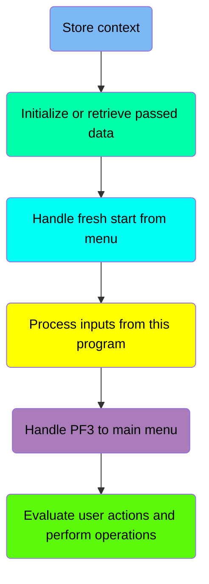

## Store context

<SwmSnippet path="/COCRDLIC/COCRDLIC.cbl" line="307">

---

### Storing Transaction ID

Going into the snippet, the code stores the transaction ID to track the current transaction throughout the program execution.

```cobol
           MOVE LIT-THISTRANID       TO WS-TRANID                               
```

---

</SwmSnippet>

## Initialize or retrieve passed data

Now, lets zoom into this section of the flow:

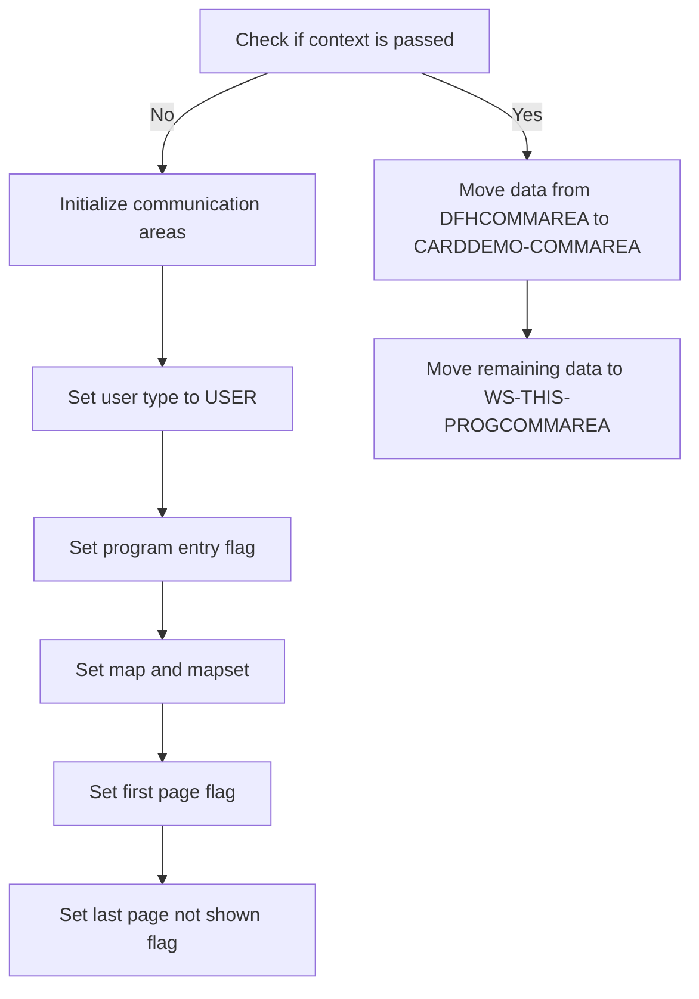

<SwmSnippet path="/COCRDLIC/COCRDLIC.cbl" line="315">

---

### Handling Initial Context

Going into the snippet, the code first checks if any context is passed. If no context is passed, it initializes the communication areas and sets various flags to indicate the transaction ID, program, user type, and map details. This setup ensures that the program starts with a clean state and the correct user context.

```cobol
           IF EIBCALEN = 0
              INITIALIZE CARDDEMO-COMMAREA
                         WS-THIS-PROGCOMMAREA 
              MOVE LIT-THISTRANID        TO CDEMO-FROM-TRANID                   
              MOVE LIT-THISPGM           TO CDEMO-FROM-PROGRAM                  
              SET CDEMO-USRTYP-USER      TO TRUE                                
              SET CDEMO-PGM-ENTER        TO TRUE                                
              MOVE LIT-THISMAP           TO CDEMO-LAST-MAP                      
              MOVE LIT-THISMAPSET        TO CDEMO-LAST-MAPSET                   
              SET CA-FIRST-PAGE          TO TRUE                                
              SET CA-LAST-PAGE-NOT-SHOWN TO TRUE                                
           ELSE
              MOVE DFHCOMMAREA (1:LENGTH OF CARDDEMO-COMMAREA) TO               
                                CARDDEMO-COMMAREA                               
              MOVE DFHCOMMAREA(LENGTH OF CARDDEMO-COMMAREA + 1:                 
                               LENGTH OF WS-THIS-PROGCOMMAREA )TO               
                                WS-THIS-PROGCOMMAREA                            
           END-IF                                                               
```

---

</SwmSnippet>

## Handle fresh start from menu

<SwmSnippet path="/COCRDLIC/COCRDLIC.cbl" line="336">

---

### Handling Initial Entry Conditions

Going into the snippet, the code checks if the program is being entered and if it is not coming from the same program. If these conditions are met, it initializes the program's communication area, sets the program entry flag to true, updates the last map used, and sets flags to indicate that the first page is being displayed and that the last page has not been shown.

```cobol
           IF (CDEMO-PGM-ENTER                                                  
           AND CDEMO-FROM-PROGRAM NOT EQUAL LIT-THISPGM)                        
               INITIALIZE WS-THIS-PROGCOMMAREA
               SET CDEMO-PGM-ENTER      TO TRUE                                 
               MOVE LIT-THISMAP         TO CDEMO-LAST-MAP                       
               SET CA-FIRST-PAGE        TO TRUE                                 
               SET CA-LAST-PAGE-NOT-SHOWN TO TRUE                               
           END-IF 
```

---

</SwmSnippet>

## Process inputs from this program

<SwmSnippet path="/COCRDLIC/COCRDLIC.cbl" line="357">

---

### Receiving and processing user inputs

Going into the snippet, the code checks if there is data present in the communication area (<SwmToken path="COCRDLIC/COCRDLIC.cbl" pos="357:3:7" line-data="           IF  EIBCALEN &gt; 0                                                     ">`EIBCALEN > 0`</SwmToken>) and if the originating program is the current program (<SwmToken path="COCRDLIC/COCRDLIC.cbl" pos="358:3:7" line-data="           AND CDEMO-FROM-PROGRAM  EQUAL LIT-THISPGM                            ">`CDEMO-FROM-PROGRAM`</SwmToken>` `<SwmToken path="COCRDLIC/COCRDLIC.cbl" pos="358:9:9" line-data="           AND CDEMO-FROM-PROGRAM  EQUAL LIT-THISPGM                            ">`EQUAL`</SwmToken>` `<SwmToken path="COCRDLIC/COCRDLIC.cbl" pos="358:11:13" line-data="           AND CDEMO-FROM-PROGRAM  EQUAL LIT-THISPGM                            ">`LIT-THISPGM`</SwmToken>). If both conditions are met, it performs the <SwmToken path="COCRDLIC/COCRDLIC.cbl" pos="359:3:7" line-data="               PERFORM 2000-RECEIVE-MAP                                         ">`2000-RECEIVE-MAP`</SwmToken> routine to receive and process the user inputs.

```cobol
           IF  EIBCALEN > 0                                                     
           AND CDEMO-FROM-PROGRAM  EQUAL LIT-THISPGM                            
               PERFORM 2000-RECEIVE-MAP                                         
               THRU    2000-RECEIVE-MAP-EXIT                                    
                                                                                
           END-IF                                                               
```

---

</SwmSnippet>

## Handle <SwmToken path="COCRDLIC/COCRDLIC.cbl" pos="382:11:11" line-data="      * If the user pressed PF3 go back to main menu                            ">`PF3`</SwmToken> to main menu

Now, lets zoom into this section of the flow:

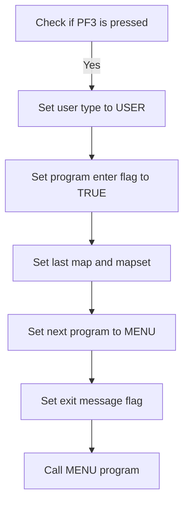

<SwmSnippet path="/COCRDLIC/COCRDLIC.cbl" line="384">

---

### Handling <SwmToken path="COCRDLIC/COCRDLIC.cbl" pos="382:11:11" line-data="      * If the user pressed PF3 go back to main menu                            ">`PF3`</SwmToken> Key Press

Going into the first snippet, the code checks if the <SwmToken path="COCRDLIC/COCRDLIC.cbl" pos="382:11:11" line-data="      * If the user pressed PF3 go back to main menu                            ">`PF3`</SwmToken> key is pressed and if the current program is the same as the originating program. If both conditions are met, it prepares for navigation back to the main menu by setting the user type, program enter flag, last map, last mapset, next program, and exit message flag.

```cobol
           IF  (CCARD-AID-PFK03                                                 
           AND CDEMO-FROM-PROGRAM  EQUAL LIT-THISPGM)                           
              MOVE LIT-THISTRANID   TO CDEMO-FROM-TRANID                        
              MOVE LIT-THISPGM      TO CDEMO-FROM-PROGRAM                       
              SET  CDEMO-USRTYP-USER TO TRUE                                    
              SET  CDEMO-PGM-ENTER  TO TRUE                                     
              MOVE LIT-THISMAPSET   TO CDEMO-LAST-MAPSET                        
              MOVE LIT-THISMAP      TO CDEMO-LAST-MAP                           
              MOVE LIT-MENUPGM      TO CDEMO-TO-PROGRAM                         
                                                                                
              MOVE LIT-MENUMAPSET   TO CCARD-NEXT-MAPSET                        
              MOVE LIT-THISMAP      TO CCARD-NEXT-MAP                           
              SET WS-EXIT-MESSAGE            TO TRUE                            
                                                                                
      *       CALL MENU PROGRAM                                                 
      *                                                                         
              SET CDEMO-PGM-ENTER   TO TRUE                                     
```

---

</SwmSnippet>

<SwmSnippet path="/COCRDLIC/COCRDLIC.cbl" line="402">

---

### Calling the Menu Program

Now, the second snippet shows the transfer of control to the menu program, ensuring that the necessary context and data are available for the menu program to execute properly.

```cobol
              EXEC CICS XCTL                                                    
                        PROGRAM (LIT-MENUPGM)                                   
                        COMMAREA(CARDDEMO-COMMAREA)                             
              END-EXEC                                                          
```

---

</SwmSnippet>

## Evaluate user actions and perform operations

Now, lets zoom into this section of the flow:

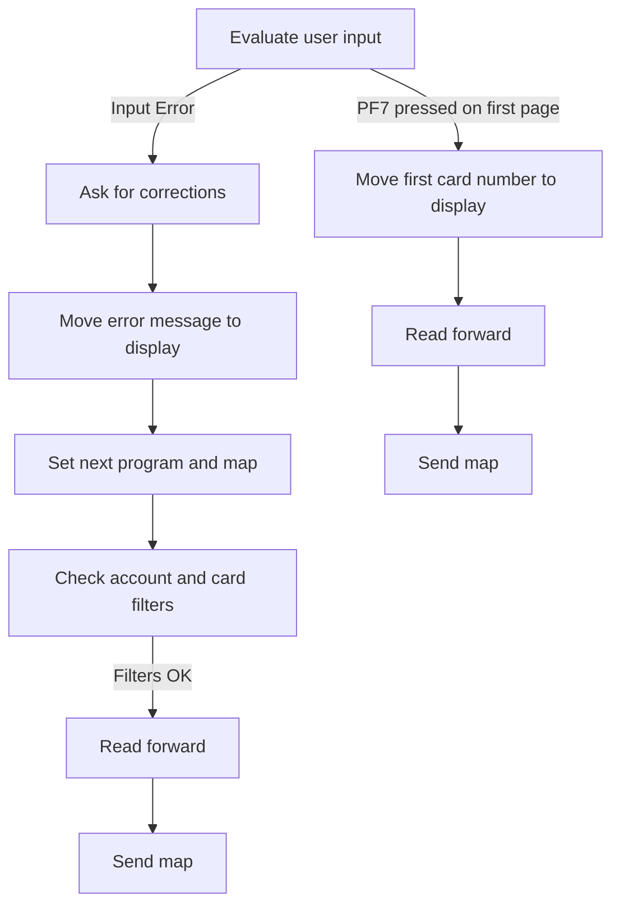

<SwmSnippet path="/COCRDLIC/COCRDLIC.cbl" line="418">

---

### Handling Input Errors

Going into the first snippet, the code evaluates the condition of user input errors. If an input error is detected, it moves the error message to be displayed to the user and sets the next program and map to the current ones. If the account and card filters are valid, it reads the next set of records and sends the updated map to the user.

```cobol
           EVALUATE TRUE                                                        
               WHEN INPUT-ERROR                                                 
      *****************************************************************         
      *        ASK FOR CORRECTIONS TO INPUTS                                    
      *****************************************************************         
                    MOVE WS-ERROR-MSG    TO CCARD-ERROR-MSG                     
                    MOVE LIT-THISPGM     TO CDEMO-FROM-PROGRAM                  
                    MOVE LIT-THISMAPSET  TO CDEMO-LAST-MAPSET                   
                    MOVE LIT-THISMAP     TO CDEMO-LAST-MAP                      
                                                                                
                    MOVE LIT-THISPGM     TO CCARD-NEXT-PROG                     
                    MOVE LIT-THISMAPSET  TO CCARD-NEXT-MAPSET                   
                    MOVE LIT-THISMAP     TO CCARD-NEXT-MAP                      
                    IF  NOT FLG-ACCTFILTER-NOT-OK                               
                    AND NOT FLG-CARDFILTER-NOT-OK                               
                       PERFORM 9000-READ-FORWARD                                
                          THRU 9000-READ-FORWARD-EXIT                           
                    END-IF                                                      
                    PERFORM 1000-SEND-MAP                                       
                       THRU 1000-SEND-MAP                                       
                    GO TO COMMON-RETURN                                         
```

---

</SwmSnippet>

# Receive and Validate Inputs (<SwmToken path="COCRDLIC/COCRDLIC.cbl" pos="359:3:7" line-data="               PERFORM 2000-RECEIVE-MAP                                         ">`2000-RECEIVE-MAP`</SwmToken>)

<SwmSnippet path="/COCRDLIC/COCRDLIC.cbl" line="951">

---

### Receiving and validating user input

Going into the <SwmToken path="COCRDLIC/COCRDLIC.cbl" pos="951:1:5" line-data="       2000-RECEIVE-MAP.                                                        ">`2000-RECEIVE-MAP`</SwmToken> function, the first step is to receive and process the screen input, which includes account ID, card number, and selection options. Next, the function sets initial flags and calls functions to validate and edit account information, credit card details, and an array.

```cobol
       2000-RECEIVE-MAP.                                                        
           PERFORM 2100-RECEIVE-SCREEN                                          
              THRU 2100-RECEIVE-SCREEN-EXIT                                     
                                                                                
           PERFORM 2200-EDIT-INPUTS                                             
            THRU   2200-EDIT-INPUTS-EXIT                                        
```

---

</SwmSnippet>

# Process screen input (<SwmToken path="COCRDLIC/COCRDLIC.cbl" pos="952:3:7" line-data="           PERFORM 2100-RECEIVE-SCREEN                                          ">`2100-RECEIVE-SCREEN`</SwmToken>)

<SwmSnippet path="/COCRDLIC/COCRDLIC.cbl" line="962">

---

### Receiving user input

Going into the first snippet, the code captures user input from the screen and stores it for further processing. This input is essential for determining which credit cards to list based on the user's selections.

```cobol
       2100-RECEIVE-SCREEN.                                                     
           EXEC CICS RECEIVE MAP(LIT-THISMAP)                                   
                          MAPSET(LIT-THISMAPSET)                                
                          INTO(CCRDLIAI)                                        
                          RESP(WS-RESP-CD)                                      
           END-EXEC                                                             
```

---

</SwmSnippet>

<SwmSnippet path="/COCRDLIC/COCRDLIC.cbl" line="969">

---

### Processing user selections

Next, the code processes the user's selections by transferring the relevant data, such as account IDs and card numbers, to working storage fields. This step ensures that the user's selections are correctly captured and can be used to filter and display the appropriate credit cards.

```cobol
           MOVE ACCTSIDI OF CCRDLIAI  TO CC-ACCT-ID                             
           MOVE CARDSIDI OF CCRDLIAI  TO CC-CARD-NUM                            
                                                                                
           MOVE CRDSEL1I OF CCRDLIAI  TO WS-EDIT-SELECT(1)                      
           MOVE CRDSEL2I OF CCRDLIAI  TO WS-EDIT-SELECT(2)                      
           MOVE CRDSEL3I OF CCRDLIAI  TO WS-EDIT-SELECT(3)                      
           MOVE CRDSEL4I OF CCRDLIAI  TO WS-EDIT-SELECT(4)                      
           MOVE CRDSEL5I OF CCRDLIAI  TO WS-EDIT-SELECT(5)                      
           MOVE CRDSEL6I OF CCRDLIAI  TO WS-EDIT-SELECT(6)                      
           MOVE CRDSEL7I OF CCRDLIAI  TO WS-EDIT-SELECT(7)                      
           .                                                                    
```

---

</SwmSnippet>

# Edit Inputs (<SwmToken path="COCRDLIC/COCRDLIC.cbl" pos="955:3:7" line-data="           PERFORM 2200-EDIT-INPUTS                                             ">`2200-EDIT-INPUTS`</SwmToken>)

<SwmSnippet path="/COCRDLIC/COCRDLIC.cbl" line="985">

---

### Editing Input Data

Going into the <SwmToken path="COCRDLIC/COCRDLIC.cbl" pos="985:1:5" line-data="       2200-EDIT-INPUTS.                                                        ">`2200-EDIT-INPUTS`</SwmToken> function, the first step is to mark the input as valid and set the protection status for selectable rows. The function then performs three main tasks: editing account information, validating the credit card number, and checking the selection array for errors. Each of these tasks is handled by separate sub-functions called in sequence to ensure all necessary edits and validations are performed on the input data.

```cobol
       2200-EDIT-INPUTS.                                                        
           SET INPUT-OK                   TO TRUE                               
           SET FLG-PROTECT-SELECT-ROWS-NO TO TRUE                               
                                                                                
           PERFORM 2210-EDIT-ACCOUNT                                            
              THRU 2210-EDIT-ACCOUNT-EXIT                                       
                                                                                
           PERFORM 2220-EDIT-CARD                                               
              THRU 2220-EDIT-CARD-EXIT                                          
                                                                                
           PERFORM 2250-EDIT-ARRAY                                              
              THRU 2250-EDIT-ARRAY-EXIT                                         
```

---

</SwmSnippet>

# Edit Account Information (<SwmToken path="COCRDLIC/COCRDLIC.cbl" pos="989:3:7" line-data="           PERFORM 2210-EDIT-ACCOUNT                                            ">`2210-EDIT-ACCOUNT`</SwmToken>)

Lets' zoom into the program flow:

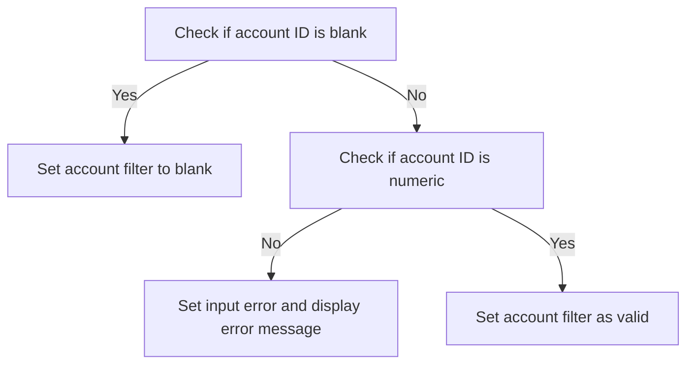

<SwmSnippet path="/COCRDLIC/COCRDLIC.cbl" line="1003">

---

### Checking if account ID is blank

Going into the first snippet, the code checks if the account ID is blank. If the account ID is either not supplied, contains only spaces, or is zero, it sets the account filter to blank and exits the function.

```cobol
       2210-EDIT-ACCOUNT.                                                       
           SET FLG-ACCTFILTER-BLANK TO TRUE                                     
                                                                                
      *    Not supplied                                                         
           IF CC-ACCT-ID   EQUAL LOW-VALUES                                     
           OR CC-ACCT-ID   EQUAL SPACES                                         
           OR CC-ACCT-ID-N EQUAL ZEROS                                          
              SET FLG-ACCTFILTER-BLANK  TO TRUE                                 
              MOVE ZEROES       TO CDEMO-ACCT-ID                                
              GO TO  2210-EDIT-ACCOUNT-EXIT                                     
           END-IF                                                               
```

---

</SwmSnippet>

<SwmSnippet path="/COCRDLIC/COCRDLIC.cbl" line="1017">

---

### Validating account ID format

Now, the second snippet checks if the account ID is numeric. If it is not numeric, it sets an input error, displays an error message indicating that the account filter must be an 11-digit number, and exits the function. If the account ID is numeric, it sets the account filter as valid.

```cobol
           IF CC-ACCT-ID  IS NOT NUMERIC                                        
              SET INPUT-ERROR TO TRUE                                           
              SET FLG-ACCTFILTER-NOT-OK TO TRUE                                 
              SET FLG-PROTECT-SELECT-ROWS-YES TO TRUE                           
              MOVE                                                              
              'ACCOUNT FILTER,IF SUPPLIED MUST BE A 11 DIGIT NUMBER'            
                              TO WS-ERROR-MSG                                   
              MOVE ZERO       TO CDEMO-ACCT-ID                                  
              GO TO 2210-EDIT-ACCOUNT-EXIT                                      
           ELSE                                                                 
              MOVE CC-ACCT-ID TO CDEMO-ACCT-ID                                  
              SET FLG-ACCTFILTER-ISVALID TO TRUE                                
           END-IF                                                               
```

---

</SwmSnippet>

# Validate Credit Card Number (<SwmToken path="COCRDLIC/COCRDLIC.cbl" pos="992:3:7" line-data="           PERFORM 2220-EDIT-CARD                                               ">`2220-EDIT-CARD`</SwmToken>)

Lets' zoom into the program flow:

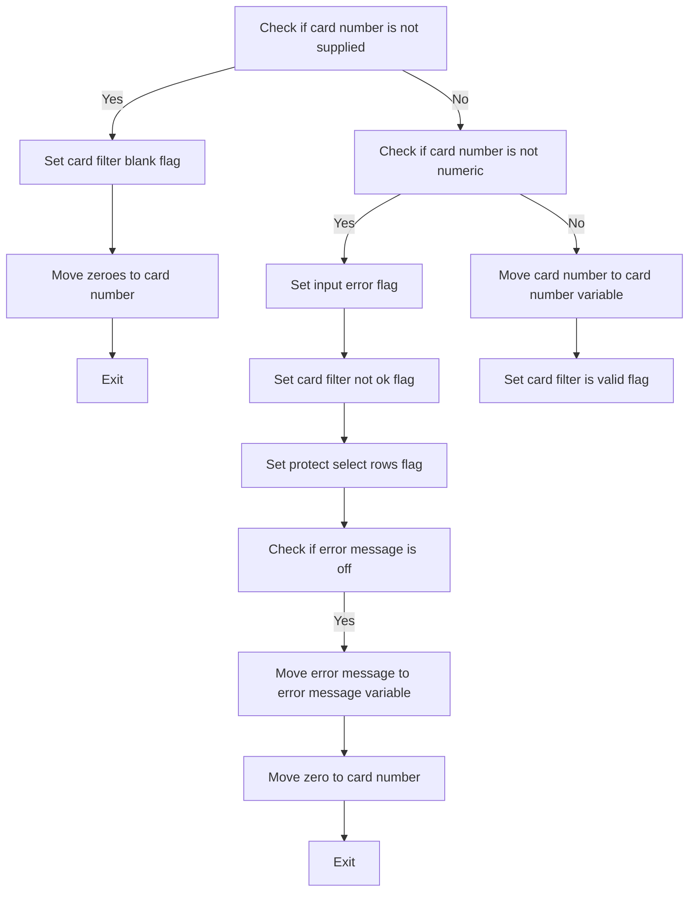

<SwmSnippet path="/COCRDLIC/COCRDLIC.cbl" line="1036">

---

### Checking if card number is not supplied

Going into the first snippet, the code checks if the credit card number is not supplied. If it is not supplied, it sets the card filter blank flag, moves zeroes to the card number, and exits the function.

```cobol
       2220-EDIT-CARD.                                                          
      *    Not numeric                                                          
      *    Not 16 characters                                                    
           SET FLG-CARDFILTER-BLANK TO TRUE                                     
                                                                                
      *    Not supplied                                                         
           IF CC-CARD-NUM   EQUAL LOW-VALUES                                    
           OR CC-CARD-NUM   EQUAL SPACES                                        
           OR CC-CARD-NUM-N EQUAL ZEROS                                         
              SET FLG-CARDFILTER-BLANK  TO TRUE                                 
              MOVE ZEROES       TO CDEMO-CARD-NUM                               
              GO TO  2220-EDIT-CARD-EXIT                                        
           END-IF                                                               
```

---

</SwmSnippet>

<SwmSnippet path="/COCRDLIC/COCRDLIC.cbl" line="1052">

---

### Checking if card number is not numeric

Next, the code checks if the credit card number is not numeric. If it is not numeric, it sets the input error flag, the card filter not ok flag, and the protect select rows flag. It then sets an error message if the error message is off, moves zero to the card number, and exits the function.

```cobol
           IF CC-CARD-NUM  IS NOT NUMERIC                                       
              SET INPUT-ERROR TO TRUE                                           
              SET FLG-CARDFILTER-NOT-OK TO TRUE                                 
              SET FLG-PROTECT-SELECT-ROWS-YES TO TRUE                           
              IF WS-ERROR-MSG-OFF                                               
                 MOVE                                                           
              'CARD ID FILTER,IF SUPPLIED MUST BE A 16 DIGIT NUMBER'            
                              TO WS-ERROR-MSG                                   
              END-IF                                                            
              MOVE ZERO       TO CDEMO-CARD-NUM                                 
              GO TO 2220-EDIT-CARD-EXIT                                         
```

---

</SwmSnippet>

<SwmSnippet path="/COCRDLIC/COCRDLIC.cbl" line="1063">

---

### Validating the card number

Then, if the credit card number is numeric, the code moves the card number to the card number variable and sets the card filter is valid flag.

```cobol
           ELSE                                                                 
              MOVE CC-CARD-NUM-N TO CDEMO-CARD-NUM                              
              SET FLG-CARDFILTER-ISVALID TO TRUE                                
           END-IF                                                               
```

---

</SwmSnippet>

# Browse records (<SwmToken path="COCRDLIC/COCRDLIC.cbl" pos="433:3:7" line-data="                       PERFORM 9000-READ-FORWARD                                ">`9000-READ-FORWARD`</SwmToken>)

Let's split this section into smaller parts:

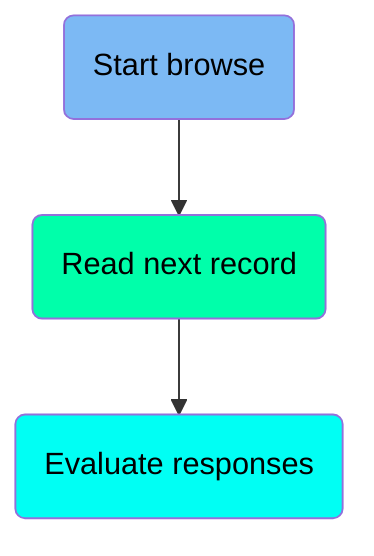

## Start browse

First, we'll zoom into this section of the flow:

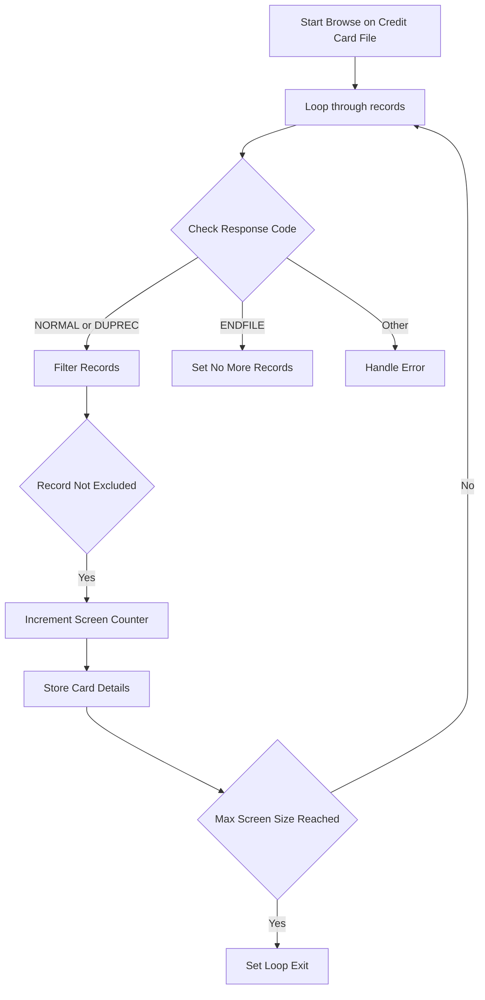

<SwmSnippet path="/COCRDLIC/COCRDLIC.cbl" line="1129">

---

### Starting Browse Operation

Going into the browse operation, it initiates reading through the credit card records sequentially. The starting point is specified, ensuring the browse starts at the correct position.

```cobol
           EXEC CICS STARTBR                                                    
                DATASET(LIT-CARD-FILE)                                          
                RIDFLD(WS-CARD-RID-CARDNUM)                                     
                KEYLENGTH(LENGTH OF WS-CARD-RID-CARDNUM)                        
                GTEQ                                                            
                RESP(WS-RESP-CD)                                                
                RESP2(WS-REAS-CD)                                               
           END-EXEC                                                             
```

---

</SwmSnippet>

## Read next record

Now, lets zoom into this section of the flow:

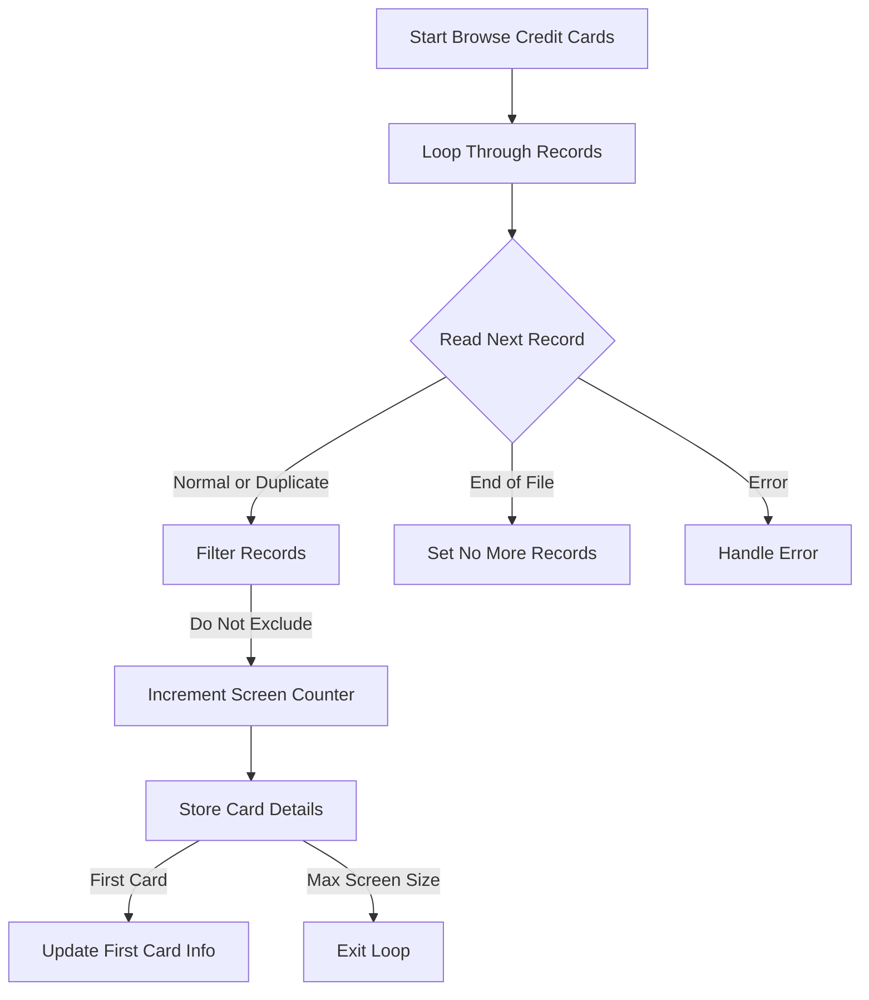

<SwmSnippet path="/COCRDLIC/COCRDLIC.cbl" line="1146">

---

### Reading the Next Credit Card Record

Going into the snippet, the code reads the next credit card record. It fetches the record details and checks the response codes to determine the next steps in processing the credit card records.

```cobol
           EXEC CICS READNEXT                                                   
                DATASET(LIT-CARD-FILE)                                          
                INTO (CARD-RECORD)                                              
                LENGTH(LENGTH OF CARD-RECORD)                                   
                RIDFLD(WS-CARD-RID-CARDNUM)                                     
                KEYLENGTH(LENGTH OF WS-CARD-RID-CARDNUM)                        
                RESP(WS-RESP-CD)                                                
                RESP2(WS-REAS-CD)                                               
           END-EXEC                                                             
```

---

</SwmSnippet>

## Evaluate responses

Now, lets zoom into this section of the flow:

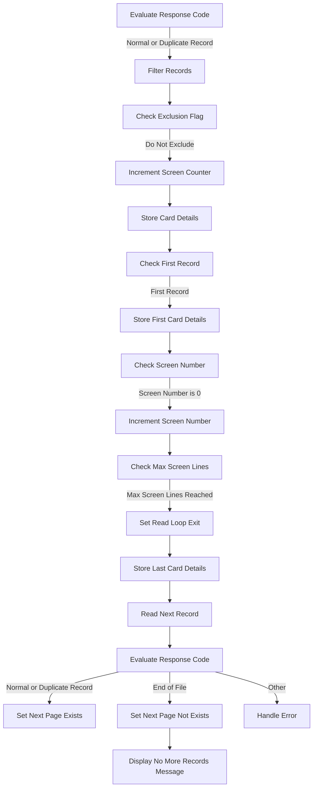

<SwmSnippet path="/COCRDLIC/COCRDLIC.cbl" line="1156">

---

### Evaluating Response Code

Going into the first snippet, the code evaluates the response code. If the response indicates a normal or duplicate record, it proceeds to filter the records.

```cobol
           EVALUATE WS-RESP-CD                                                  
               WHEN DFHRESP(NORMAL)                                             
               WHEN DFHRESP(DUPREC)                                             
                   PERFORM 9500-FILTER-RECORDS                                  
                      THRU 9500-FILTER-RECORDS-EXIT                             
```

---

</SwmSnippet>

# Filter Credit Card Records (<SwmToken path="COCRDLIC/COCRDLIC.cbl" pos="1159:3:7" line-data="                   PERFORM 9500-FILTER-RECORDS                                  ">`9500-FILTER-RECORDS`</SwmToken>)

Lets' zoom into the program flow:

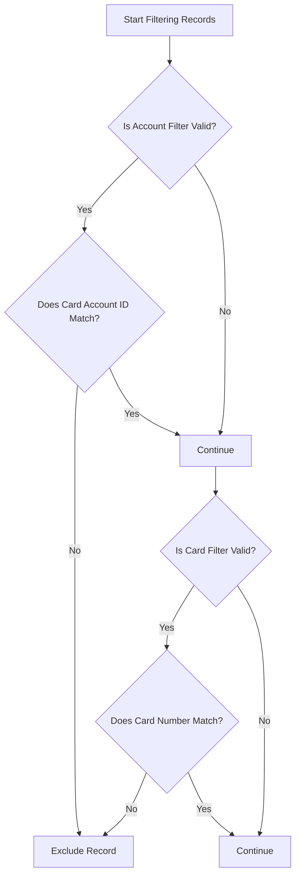

<SwmSnippet path="/COCRDLIC/COCRDLIC.cbl" line="1382">

---

### Filtering based on account validation

Going into the first snippet, the code checks if the account filter is valid. If the account filter is valid, it then compares the card account ID with the account ID in the context. If they do not match, the record is marked for exclusion and the filter process exits.

```cobol
       9500-FILTER-RECORDS.                                                     
           SET WS-DONOT-EXCLUDE-THIS-RECORD TO TRUE                             
                                                                                
           IF FLG-ACCTFILTER-ISVALID                                            
              IF  CARD-ACCT-ID = CC-ACCT-ID                                     
                  CONTINUE                                                      
              ELSE                                                              
                  SET WS-EXCLUDE-THIS-RECORD  TO TRUE                           
                  GO TO 9500-FILTER-RECORDS-EXIT                                
              END-IF                                                            
           ELSE                                                                 
             CONTINUE                                                           
           END-IF                                                               
```

---

</SwmSnippet>

<SwmSnippet path="/COCRDLIC/COCRDLIC.cbl" line="1396">

---

### Filtering based on card number validation

Moving to the second snippet, the code checks if the card filter is valid. If the card filter is valid, it then compares the card number with the card number in the context. If they do not match, the record is marked for exclusion and the filter process exits.

```cobol
           IF FLG-CARDFILTER-ISVALID                                            
              IF  CARD-NUM = CC-CARD-NUM-N                                      
                  CONTINUE                                                      
              ELSE                                                              
                  SET WS-EXCLUDE-THIS-RECORD TO TRUE                            
                  GO TO 9500-FILTER-RECORDS-EXIT                                
              END-IF                                                            
           ELSE                                                                 
             CONTINUE                                                           
           END-IF                                                               
```

---

</SwmSnippet>

# Send Map (<SwmToken path="COCRDLIC/COCRDLIC.cbl" pos="436:3:7" line-data="                    PERFORM 1000-SEND-MAP                                       ">`1000-SEND-MAP`</SwmToken>)

<SwmSnippet path="/COCRDLIC/COCRDLIC.cbl" line="624">

---

### Sending the Screen Map

The <SwmToken path="COCRDLIC/COCRDLIC.cbl" pos="624:1:5" line-data="       1000-SEND-MAP.                                                           ">`1000-SEND-MAP`</SwmToken> function is responsible for displaying the screen map. It initializes the display information, sets up the screen array with credit card details, configures attributes for selection rows, and sets up messages based on various conditions. Finally, it sends the screen to the user.

```cobol
       1000-SEND-MAP.                                                           
           PERFORM 1100-SCREEN-INIT                                             
              THRU 1100-SCREEN-INIT-EXIT                                        
           PERFORM 1200-SCREEN-ARRAY-INIT                                       
              THRU 1200-SCREEN-ARRAY-INIT-EXIT                                  
           PERFORM 1250-SETUP-ARRAY-ATTRIBS                                     
              THRU 1250-SETUP-ARRAY-ATTRIBS-EXIT                                
           PERFORM 1300-SETUP-SCREEN-ATTRS                                      
              THRU 1300-SETUP-SCREEN-ATTRS-EXIT                                 
           PERFORM 1400-SETUP-MESSAGE                                           
              THRU 1400-SETUP-MESSAGE-EXIT                                      
           PERFORM 1500-SEND-SCREEN                                             
              THRU 1500-SEND-SCREEN-EXIT                                        
```

---

</SwmSnippet>

# Initialize screen display (<SwmToken path="COCRDLIC/COCRDLIC.cbl" pos="625:3:7" line-data="           PERFORM 1100-SCREEN-INIT                                             ">`1100-SCREEN-INIT`</SwmToken>)

<SwmSnippet path="/COCRDLIC/COCRDLIC.cbl" line="642">

---

### Initializing Screen Data

Going into the <SwmToken path="COCRDLIC/COCRDLIC.cbl" pos="642:1:5" line-data="       1100-SCREEN-INIT.                                                        ">`1100-SCREEN-INIT`</SwmToken> function, it starts by setting up the initial values for the screen display. It initializes the screen with the current date and time, formatted into different components such as month, day, year, hours, minutes, and seconds. These formatted values are then moved to the corresponding fields for display. Additionally, titles and program names are set up for the screen, and a page number is assigned. Finally, an informational message is prepared for display.

```cobol
       1100-SCREEN-INIT.                                                        
           MOVE LOW-VALUES             TO CCRDLIAO                              
                                                                                
           MOVE FUNCTION CURRENT-DATE  TO WS-CURDATE-DATA                       
                                                                                
           MOVE CCDA-TITLE01           TO TITLE01O OF CCRDLIAO                  
           MOVE CCDA-TITLE02           TO TITLE02O OF CCRDLIAO                  
           MOVE LIT-THISTRANID         TO TRNNAMEO OF CCRDLIAO                  
           MOVE LIT-THISPGM            TO PGMNAMEO OF CCRDLIAO                  
                                                                                
           MOVE FUNCTION CURRENT-DATE  TO WS-CURDATE-DATA                       
                                                                                
           MOVE WS-CURDATE-MONTH       TO WS-CURDATE-MM                         
           MOVE WS-CURDATE-DAY         TO WS-CURDATE-DD                         
           MOVE WS-CURDATE-YEAR(3:2)   TO WS-CURDATE-YY                         
                                                                                
           MOVE WS-CURDATE-MM-DD-YY    TO CURDATEO OF CCRDLIAO                  
                                                                                
           MOVE WS-CURTIME-HOURS       TO WS-CURTIME-HH                         
           MOVE WS-CURTIME-MINUTE      TO WS-CURTIME-MM                         
           MOVE WS-CURTIME-SECOND      TO WS-CURTIME-SS                         
                                                                                
           MOVE WS-CURTIME-HH-MM-SS    TO CURTIMEO OF CCRDLIAO                  
      *    PAGE NUMBER                                                          
      *                                                                         
           MOVE WS-CA-SCREEN-NUM       TO PAGENOO  OF CCRDLIAO                  
                                                                                
           SET WS-NO-INFO-MESSAGE      TO TRUE                                  
           MOVE WS-INFO-MSG            TO INFOMSGO OF CCRDLIAO                  
           MOVE DFHBMDAR               TO INFOMSGC OF CCRDLIAO                  
           .                                                                    
```

---

</SwmSnippet>

&nbsp;

*This is an auto-generated document by Swimm 🌊 and has not yet been verified by a human*

<SwmMeta version="3.0.0" repo-id="Z2l0aHViJTNBJTNBb3BlbmxlZ2FjeWRlbW8lM0ElM0FTd2ltbS1EZW1v" repo-name="openlegacydemo"><sup>Powered by [Swimm](/)</sup></SwmMeta>
