This document describes the flow of handling user interactions within the <SwmToken path="COUSR00C/COUSR00C.cbl" pos="3:7:7" line-data="      * Application : CardDemo">`CardDemo`</SwmToken> application, specifically using the <SwmToken path="COUSR00C/COUSR00C.cbl" pos="2:7:7" line-data="      * Program     : COUSR00C.CBL">`COUSR00C`</SwmToken> program. The program's primary role is to list all users from the USRSEC file. This is achieved by initializing necessary flags and variables, checking communication area lengths, processing user inputs, and managing pagination.

For instance, when a user presses the enter key, the program processes the input and sends the user list screen. If the user presses PF3, the program transitions to another screen. The input is received via the user list screen, and the output is the updated user list displayed to the user.

# Handle User Interaction (<SwmToken path="COUSR00C/COUSR00C.cbl" pos="98:1:3" line-data="       MAIN-PARA.">`MAIN-PARA`</SwmToken>)

Lets' zoom into the program flow:

```mermaid
graph TD
  A[Initialize flags and variables] --> B{Check if EIBCALEN is 0}
  B -- Yes --> C[Set program to COSGN00C]
  C --> D[Return to previous screen]
  B -- No --> E[Move DFHCOMMAREA to CARDDEMO-COMMAREA]
  E --> F{Check if program is re-entered}
  F -- No --> G[Set re-enter flag to true]
  G --> H[Move low values to COUSR0AO]
  H --> I[Process enter key]
  I --> J[Send user list screen]
  F -- Yes --> K[Receive user list screen]
  K --> L{Evaluate EIBAID}
  L -- DFHENTER --> M[Process enter key]
  L -- DFHPF3 --> N[Set program to COADM01C]
  N --> O[Return to previous screen]
  L -- DFHPF7 --> P[Process PF7 key]
  L -- DFHPF8 --> Q[Process PF8 key]
  L -- Other --> R[Set error flag]
  R --> S[Move invalid key message to WS-MESSAGE]
  S --> T[Send user list screen]

%% Swimm:
%% graph TD
%%   A[Initialize flags and variables] --> B{Check if EIBCALEN is 0}
%%   B -- Yes --> C[Set program to <SwmToken path="COUSR00C/COUSR00C.cbl" pos="111:4:4" line-data="               MOVE &#39;COSGN00C&#39; TO CDEMO-TO-PROGRAM">`COSGN00C`</SwmToken>]
%%   C --> D[Return to previous screen]
%%   B -- No --> E[Move DFHCOMMAREA to <SwmToken path="COUSR00C/COUSR00C.cbl" pos="114:12:14" line-data="               MOVE DFHCOMMAREA(1:EIBCALEN) TO CARDDEMO-COMMAREA">`CARDDEMO-COMMAREA`</SwmToken>]
%%   E --> F{Check if program is re-entered}
%%   F -- No --> G[Set re-enter flag to true]
%%   G --> H[Move low values to <SwmToken path="COUSR00C/COUSR00C.cbl" pos="106:5:5" line-data="                          ERRMSGO OF COUSR0AO">`COUSR0AO`</SwmToken>]
%%   H --> I[Process enter key]
%%   I --> J[Send user list screen]
%%   F -- Yes --> K[Receive user list screen]
%%   K --> L{Evaluate EIBAID}
%%   L -- DFHENTER --> M[Process enter key]
%%   L -- <SwmToken path="COUSR00C/COUSR00C.cbl" pos="125:3:3" line-data="                       WHEN DFHPF3">`DFHPF3`</SwmToken> --> N[Set program to <SwmToken path="COUSR00C/COUSR00C.cbl" pos="126:4:4" line-data="                           MOVE &#39;COADM01C&#39; TO CDEMO-TO-PROGRAM">`COADM01C`</SwmToken>]
%%   N --> O[Return to previous screen]
%%   L -- <SwmToken path="COUSR00C/COUSR00C.cbl" pos="128:3:3" line-data="                       WHEN DFHPF7">`DFHPF7`</SwmToken> --> P[Process <SwmToken path="COUSR00C/COUSR00C.cbl" pos="129:5:5" line-data="                           PERFORM PROCESS-PF7-KEY">`PF7`</SwmToken> key]
%%   L -- <SwmToken path="COUSR00C/COUSR00C.cbl" pos="130:3:3" line-data="                       WHEN DFHPF8">`DFHPF8`</SwmToken> --> Q[Process <SwmToken path="COUSR00C/COUSR00C.cbl" pos="131:5:5" line-data="                           PERFORM PROCESS-PF8-KEY">`PF8`</SwmToken> key]
%%   L -- Other --> R[Set error flag]
%%   R --> S[Move invalid key message to <SwmToken path="COUSR00C/COUSR00C.cbl" pos="105:7:9" line-data="           MOVE SPACES TO WS-MESSAGE">`WS-MESSAGE`</SwmToken>]
%%   S --> T[Send user list screen]
```

<SwmSnippet path="/COUSR00C/COUSR00C.cbl" line="98">

---

### Initializing flags and variables

Going into the first snippet, the code initializes several flags and variables. It ensures that no error is flagged, indicates that there are more user records to process, prepares for pagination, and sets up the screen for erasure. Additionally, it clears any existing messages and resets the user ID input length.

```cobol
       MAIN-PARA.

           SET ERR-FLG-OFF TO TRUE
           SET USER-SEC-NOT-EOF TO TRUE
           SET NEXT-PAGE-NO TO TRUE
           SET SEND-ERASE-YES TO TRUE

           MOVE SPACES TO WS-MESSAGE
                          ERRMSGO OF COUSR0AO

           MOVE -1       TO USRIDINL OF COUSR0AI
```

---

</SwmSnippet>

<SwmSnippet path="/COUSR00C/COUSR00C.cbl" line="110">

---

### Checking EIBCALEN

Now, the code checks if the length of the communication area is zero. If it is, it sets the next program to <SwmToken path="COUSR00C/COUSR00C.cbl" pos="111:4:4" line-data="               MOVE &#39;COSGN00C&#39; TO CDEMO-TO-PROGRAM">`COSGN00C`</SwmToken> and transfers control to the previous screen.

```cobol
           IF EIBCALEN = 0
               MOVE 'COSGN00C' TO CDEMO-TO-PROGRAM
               PERFORM RETURN-TO-PREV-SCREEN
```

---

</SwmSnippet>

<SwmSnippet path="/COUSR00C/COUSR00C.cbl" line="113">

---

### Handling non-zero EIBCALEN

Moving to the next snippet, if the communication area length is not zero, the code transfers the communication area data to a local area. It then checks if the program is re-entered. If not, it sets the re-enter flag, clears the user session data, processes the enter key, and sends the user list screen.

```cobol
           ELSE
               MOVE DFHCOMMAREA(1:EIBCALEN) TO CARDDEMO-COMMAREA
               IF NOT CDEMO-PGM-REENTER
                   SET CDEMO-PGM-REENTER    TO TRUE
                   MOVE LOW-VALUES          TO COUSR0AO
                   PERFORM PROCESS-ENTER-KEY
                   PERFORM SEND-USRLST-SCREEN
```

---

</SwmSnippet>

<SwmSnippet path="/COUSR00C/COUSR00C.cbl" line="120">

---

### Evaluating user input

Then, the code evaluates the user input. If the enter key is pressed, it processes the enter key. If PF3 is pressed, it sets the next program to <SwmToken path="COUSR00C/COUSR00C.cbl" pos="126:4:4" line-data="                           MOVE &#39;COADM01C&#39; TO CDEMO-TO-PROGRAM">`COADM01C`</SwmToken> and transfers control to the previous screen. If <SwmToken path="COUSR00C/COUSR00C.cbl" pos="129:5:5" line-data="                           PERFORM PROCESS-PF7-KEY">`PF7`</SwmToken> or <SwmToken path="COUSR00C/COUSR00C.cbl" pos="131:5:5" line-data="                           PERFORM PROCESS-PF8-KEY">`PF8`</SwmToken> is pressed, it processes the respective keys. For any other input, it sets an error flag, resets the user ID input length, sets an invalid key message, and sends the user list screen.

```cobol
               ELSE
                   PERFORM RECEIVE-USRLST-SCREEN
                   EVALUATE EIBAID
                       WHEN DFHENTER
                           PERFORM PROCESS-ENTER-KEY
                       WHEN DFHPF3
                           MOVE 'COADM01C' TO CDEMO-TO-PROGRAM
                           PERFORM RETURN-TO-PREV-SCREEN
                       WHEN DFHPF7
                           PERFORM PROCESS-PF7-KEY
                       WHEN DFHPF8
                           PERFORM PROCESS-PF8-KEY
                       WHEN OTHER
                           MOVE 'Y'                       TO WS-ERR-FLG
                           MOVE -1       TO USRIDINL OF COUSR0AI
                           MOVE CCDA-MSG-INVALID-KEY      TO WS-MESSAGE
                           PERFORM SEND-USRLST-SCREEN
                   END-EVALUATE
               END-IF
```

---

</SwmSnippet>

# Return to previous screen (<SwmToken path="COUSR00C/COUSR00C.cbl" pos="112:3:9" line-data="               PERFORM RETURN-TO-PREV-SCREEN">`RETURN-TO-PREV-SCREEN`</SwmToken>)

<SwmSnippet path="/COUSR00C/COUSR00C.cbl" line="506">

---

Going into the first snippet, the code checks if the <SwmToken path="COUSR00C/COUSR00C.cbl" pos="508:3:7" line-data="           IF CDEMO-TO-PROGRAM = LOW-VALUES OR SPACES">`CDEMO-TO-PROGRAM`</SwmToken> variable is either uninitialized or empty. If it is, the code assigns the value <SwmToken path="COUSR00C/COUSR00C.cbl" pos="509:4:4" line-data="               MOVE &#39;COSGN00C&#39; TO CDEMO-TO-PROGRAM">`COSGN00C`</SwmToken> to <SwmToken path="COUSR00C/COUSR00C.cbl" pos="508:3:7" line-data="           IF CDEMO-TO-PROGRAM = LOW-VALUES OR SPACES">`CDEMO-TO-PROGRAM`</SwmToken>. This ensures that there is always a valid program to return to, preventing any potential errors or undefined behavior.

```cobol
       RETURN-TO-PREV-SCREEN.

           IF CDEMO-TO-PROGRAM = LOW-VALUES OR SPACES
               MOVE 'COSGN00C' TO CDEMO-TO-PROGRAM
           END-IF
```

---

</SwmSnippet>

<SwmSnippet path="/COUSR00C/COUSR00C.cbl" line="511">

---

Next, the second snippet sets up the necessary context for returning to the previous screen. It moves the current transaction ID and program name into <SwmToken path="COUSR00C/COUSR00C.cbl" pos="511:9:13" line-data="           MOVE WS-TRANID    TO CDEMO-FROM-TRANID">`CDEMO-FROM-TRANID`</SwmToken> and <SwmToken path="COUSR00C/COUSR00C.cbl" pos="512:9:13" line-data="           MOVE WS-PGMNAME   TO CDEMO-FROM-PROGRAM">`CDEMO-FROM-PROGRAM`</SwmToken> respectively, and resets the program context by setting <SwmToken path="COUSR00C/COUSR00C.cbl" pos="513:7:11" line-data="           MOVE ZEROS        TO CDEMO-PGM-CONTEXT">`CDEMO-PGM-CONTEXT`</SwmToken> to zero. Finally, it executes a CICS <SwmToken path="COUSR00C/COUSR00C.cbl" pos="515:1:1" line-data="               XCTL PROGRAM(CDEMO-TO-PROGRAM)">`XCTL`</SwmToken> command to transfer control to the program specified in <SwmToken path="COUSR00C/COUSR00C.cbl" pos="515:5:9" line-data="               XCTL PROGRAM(CDEMO-TO-PROGRAM)">`CDEMO-TO-PROGRAM`</SwmToken>, passing along the <SwmToken path="COUSR00C/COUSR00C.cbl" pos="516:3:5" line-data="               COMMAREA(CARDDEMO-COMMAREA)">`CARDDEMO-COMMAREA`</SwmToken> to maintain the state.

```cobol
           MOVE WS-TRANID    TO CDEMO-FROM-TRANID
           MOVE WS-PGMNAME   TO CDEMO-FROM-PROGRAM
           MOVE ZEROS        TO CDEMO-PGM-CONTEXT
           EXEC CICS
               XCTL PROGRAM(CDEMO-TO-PROGRAM)
               COMMAREA(CARDDEMO-COMMAREA)
           END-EXEC.
```

---

</SwmSnippet>

# Process user selection (<SwmToken path="COUSR00C/COUSR00C.cbl" pos="118:3:7" line-data="                   PERFORM PROCESS-ENTER-KEY">`PROCESS-ENTER-KEY`</SwmToken>)

Let's split this section into smaller parts:

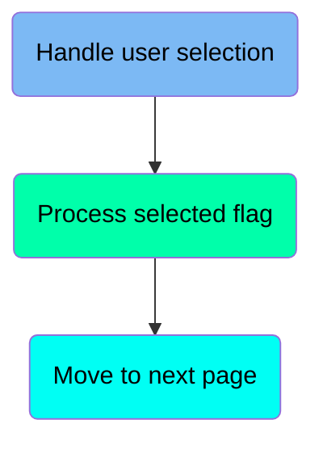

## Handle user selection

<SwmSnippet path="/COUSR00C/COUSR00C.cbl" line="149">

---

### Handling user selection

Going into the <SwmToken path="COUSR00C/COUSR00C.cbl" pos="149:1:5" line-data="       PROCESS-ENTER-KEY.">`PROCESS-ENTER-KEY`</SwmToken> function, the code evaluates different user selection flags and moves the corresponding user ID to the selected user variable. It checks each flag from <SwmToken path="COUSR00C/COUSR00C.cbl" pos="152:3:3" line-data="               WHEN SEL0001I OF COUSR0AI NOT = SPACES AND LOW-VALUES">`SEL0001I`</SwmToken> to <SwmToken path="COUSR00C/COUSR00C.cbl" pos="179:3:3" line-data="               WHEN SEL0010I OF COUSR0AI NOT = SPACES AND LOW-VALUES">`SEL0010I`</SwmToken>, and if a flag is not empty or low-values, it updates the selected user flag and user ID accordingly. If none of the flags are set, it clears the selected user flag and user ID.

```cobol
       PROCESS-ENTER-KEY.

           EVALUATE TRUE
               WHEN SEL0001I OF COUSR0AI NOT = SPACES AND LOW-VALUES
                   MOVE SEL0001I OF COUSR0AI TO CDEMO-CU00-USR-SEL-FLG
                   MOVE USRID01I OF COUSR0AI TO CDEMO-CU00-USR-SELECTED
               WHEN SEL0002I OF COUSR0AI NOT = SPACES AND LOW-VALUES
                   MOVE SEL0002I OF COUSR0AI TO CDEMO-CU00-USR-SEL-FLG
                   MOVE USRID02I OF COUSR0AI TO CDEMO-CU00-USR-SELECTED
               WHEN SEL0003I OF COUSR0AI NOT = SPACES AND LOW-VALUES
                   MOVE SEL0003I OF COUSR0AI TO CDEMO-CU00-USR-SEL-FLG
                   MOVE USRID03I OF COUSR0AI TO CDEMO-CU00-USR-SELECTED
               WHEN SEL0004I OF COUSR0AI NOT = SPACES AND LOW-VALUES
                   MOVE SEL0004I OF COUSR0AI TO CDEMO-CU00-USR-SEL-FLG
                   MOVE USRID04I OF COUSR0AI TO CDEMO-CU00-USR-SELECTED
               WHEN SEL0005I OF COUSR0AI NOT = SPACES AND LOW-VALUES
                   MOVE SEL0005I OF COUSR0AI TO CDEMO-CU00-USR-SEL-FLG
                   MOVE USRID05I OF COUSR0AI TO CDEMO-CU00-USR-SELECTED
               WHEN SEL0006I OF COUSR0AI NOT = SPACES AND LOW-VALUES
                   MOVE SEL0006I OF COUSR0AI TO CDEMO-CU00-USR-SEL-FLG
                   MOVE USRID06I OF COUSR0AI TO CDEMO-CU00-USR-SELECTED
               WHEN SEL0007I OF COUSR0AI NOT = SPACES AND LOW-VALUES
                   MOVE SEL0007I OF COUSR0AI TO CDEMO-CU00-USR-SEL-FLG
                   MOVE USRID07I OF COUSR0AI TO CDEMO-CU00-USR-SELECTED
               WHEN SEL0008I OF COUSR0AI NOT = SPACES AND LOW-VALUES
                   MOVE SEL0008I OF COUSR0AI TO CDEMO-CU00-USR-SEL-FLG
                   MOVE USRID08I OF COUSR0AI TO CDEMO-CU00-USR-SELECTED
               WHEN SEL0009I OF COUSR0AI NOT = SPACES AND LOW-VALUES
                   MOVE SEL0009I OF COUSR0AI TO CDEMO-CU00-USR-SEL-FLG
                   MOVE USRID09I OF COUSR0AI TO CDEMO-CU00-USR-SELECTED
               WHEN SEL0010I OF COUSR0AI NOT = SPACES AND LOW-VALUES
                   MOVE SEL0010I OF COUSR0AI TO CDEMO-CU00-USR-SEL-FLG
                   MOVE USRID10I OF COUSR0AI TO CDEMO-CU00-USR-SELECTED
               WHEN OTHER
                   MOVE SPACES   TO CDEMO-CU00-USR-SEL-FLG
                   MOVE SPACES   TO CDEMO-CU00-USR-SELECTED
           END-EVALUATE
```

---

</SwmSnippet>

## Process selected flag

Now, lets zoom into this section of the flow:

```mermaid
graph TD
  A[Check if user selection is valid] --> B{User selection flag}
  B -->|U or u| C[Set target program to COUSR02C]
  B -->|D or d| D[Set target program to COUSR03C]
  B -->|Other| E[Set error message]
  C --> F[Transfer control to COUSR02C]
  D --> G[Transfer control to COUSR03C]
  E --> H[Display error message]

%% Swimm:
%% graph TD
%%   A[Check if user selection is valid] --> B{User selection flag}
%%   B -->|U or u| C[Set target program to <SwmToken path="COUSR00C/COUSR00C.cbl" pos="192:4:4" line-data="                        MOVE &#39;COUSR02C&#39;   TO CDEMO-TO-PROGRAM">`COUSR02C`</SwmToken>]
%%   B -->|D or d| D[Set target program to <SwmToken path="COUSR00C/COUSR00C.cbl" pos="202:4:4" line-data="                        MOVE &#39;COUSR03C&#39;   TO CDEMO-TO-PROGRAM">`COUSR03C`</SwmToken>]
%%   B -->|Other| E[Set error message]
%%   C --> F[Transfer control to <SwmToken path="COUSR00C/COUSR00C.cbl" pos="192:4:4" line-data="                        MOVE &#39;COUSR02C&#39;   TO CDEMO-TO-PROGRAM">`COUSR02C`</SwmToken>]
%%   D --> G[Transfer control to <SwmToken path="COUSR00C/COUSR00C.cbl" pos="202:4:4" line-data="                        MOVE &#39;COUSR03C&#39;   TO CDEMO-TO-PROGRAM">`COUSR03C`</SwmToken>]
%%   E --> H[Display error message]
```

<SwmSnippet path="/COUSR00C/COUSR00C.cbl" line="187">

---

### Handling user selection for update

Going into the first snippet, the code checks if the user selection is valid. If the user selection flag is 'U' or 'u', it sets the target program to handle updating user information and transfers control to this program.

```cobol
           IF (CDEMO-CU00-USR-SEL-FLG NOT = SPACES AND LOW-VALUES) AND
              (CDEMO-CU00-USR-SELECTED NOT = SPACES AND LOW-VALUES)
               EVALUATE CDEMO-CU00-USR-SEL-FLG
                   WHEN 'U'
                   WHEN 'u'
                        MOVE 'COUSR02C'   TO CDEMO-TO-PROGRAM
                        MOVE WS-TRANID    TO CDEMO-FROM-TRANID
                        MOVE WS-PGMNAME   TO CDEMO-FROM-PROGRAM
                        MOVE 0        TO CDEMO-PGM-CONTEXT
                        EXEC CICS
                            XCTL PROGRAM(CDEMO-TO-PROGRAM)
                            COMMAREA(CARDDEMO-COMMAREA)
                        END-EXEC
```

---

</SwmSnippet>

<SwmSnippet path="/COUSR00C/COUSR00C.cbl" line="200">

---

### Handling user selection for deletion

Now, moving to the second snippet, if the user selection flag is 'D' or 'd', the code sets the target program to handle deleting user information and transfers control to this program.

```cobol
                   WHEN 'D'
                   WHEN 'd'
                        MOVE 'COUSR03C'   TO CDEMO-TO-PROGRAM
                        MOVE WS-TRANID    TO CDEMO-FROM-TRANID
                        MOVE WS-PGMNAME   TO CDEMO-FROM-PROGRAM
                        MOVE 0        TO CDEMO-PGM-CONTEXT
                        EXEC CICS
                            XCTL PROGRAM(CDEMO-TO-PROGRAM)
                            COMMAREA(CARDDEMO-COMMAREA)
                        END-EXEC
```

---

</SwmSnippet>

<SwmSnippet path="/COUSR00C/COUSR00C.cbl" line="210">

---

### Handling invalid user selection

Next, in the third snippet, if the user selection flag is neither 'U' nor 'D', the code sets an error message indicating that the selection is invalid and that valid values are 'U' and 'D'. This message is then displayed to the user.

```cobol
                   WHEN OTHER
                       MOVE
                       'Invalid selection. Valid values are U and D' TO
                                       WS-MESSAGE
                       MOVE -1       TO USRIDINL OF COUSR0AI
               END-EVALUATE
```

---

</SwmSnippet>

## Move to next page

Now, lets zoom into this section of the flow:

```mermaid
graph TD
  A[Check user selection] -->|SEL0001I to SEL0010I| B[Set user selection flag and ID]
  B --> C{Is selection valid?}
  C -->|Yes| D{Check selection flag}
  D -->|U or u| E[Set program to COUSR02C and transfer control]
  D -->|D or d| F[Set program to COUSR03C and transfer control]
  D -->|Other| G[Set error message and flag]
  C -->|No| H[Clear selection flag and ID]
  H --> I[Check user ID input]
  I -->|Empty| J[Set default user ID]
  I -->|Not empty| K[Set user ID from input]
  K --> L[Reset user input length]
  L --> M[Reset page number and process next page]
  M -->|No error| N[Clear user ID output]

%% Swimm:
%% graph TD
%%   A[Check user selection] -->|<SwmToken path="COUSR00C/COUSR00C.cbl" pos="152:3:3" line-data="               WHEN SEL0001I OF COUSR0AI NOT = SPACES AND LOW-VALUES">`SEL0001I`</SwmToken> to <SwmToken path="COUSR00C/COUSR00C.cbl" pos="179:3:3" line-data="               WHEN SEL0010I OF COUSR0AI NOT = SPACES AND LOW-VALUES">`SEL0010I`</SwmToken>| B[Set user selection flag and ID]
%%   B --> C{Is selection valid?}
%%   C -->|Yes| D{Check selection flag}
%%   D -->|U or u| E[Set program to <SwmToken path="COUSR00C/COUSR00C.cbl" pos="192:4:4" line-data="                        MOVE &#39;COUSR02C&#39;   TO CDEMO-TO-PROGRAM">`COUSR02C`</SwmToken> and transfer control]
%%   D -->|D or d| F[Set program to <SwmToken path="COUSR00C/COUSR00C.cbl" pos="202:4:4" line-data="                        MOVE &#39;COUSR03C&#39;   TO CDEMO-TO-PROGRAM">`COUSR03C`</SwmToken> and transfer control]
%%   D -->|Other| G[Set error message and flag]
%%   C -->|No| H[Clear selection flag and ID]
%%   H --> I[Check user ID input]
%%   I -->|Empty| J[Set default user ID]
%%   I -->|Not empty| K[Set user ID from input]
%%   K --> L[Reset user input length]
%%   L --> M[Reset page number and process next page]
%%   M -->|No error| N[Clear user ID output]
```

# Process page forward (<SwmToken path="COUSR00C/COUSR00C.cbl" pos="228:3:7" line-data="           PERFORM PROCESS-PAGE-FORWARD">`PROCESS-PAGE-FORWARD`</SwmToken>)

Let's split this section into smaller parts:

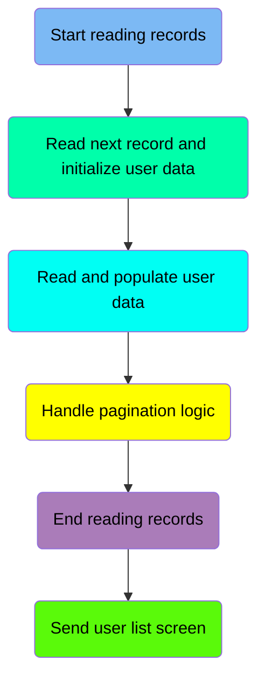

## Start reading records

First, we'll zoom into this section of the flow:

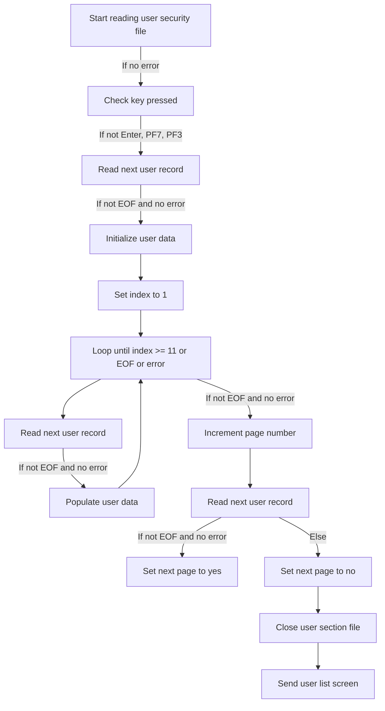

<SwmSnippet path="/COUSR00C/COUSR00C.cbl" line="284">

---

### Starting the user security file read

Going into the <SwmToken path="COUSR00C/COUSR00C.cbl" pos="228:3:7" line-data="           PERFORM PROCESS-PAGE-FORWARD">`PROCESS-PAGE-FORWARD`</SwmToken> function, the code starts by initiating the reading of records from the user security file, preparing the system to list all users.

```cobol
           PERFORM STARTBR-USER-SEC-FILE
```

---

</SwmSnippet>

## Read next record and initialize user data

Now, lets zoom into this section of the flow:

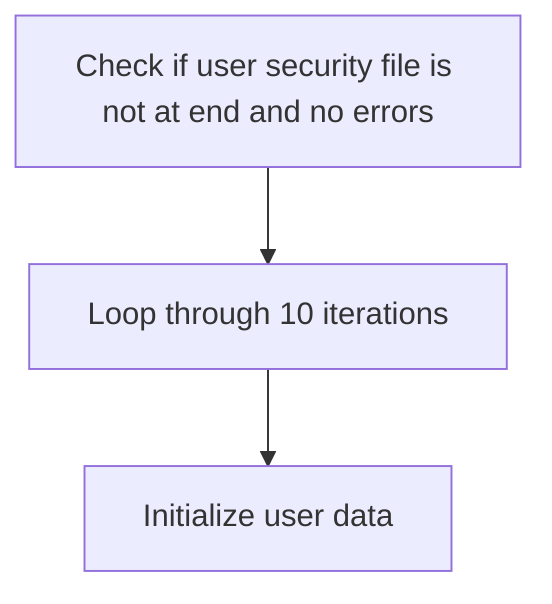

<SwmSnippet path="/COUSR00C/COUSR00C.cbl" line="292">

---

### Looping through user data initialization

Going into the snippet, the code first checks if the user security file has not reached the end and if there are no errors. If both conditions are met, it performs a loop that iterates 10 times. During each iteration, it initializes user data.

```cobol
               IF USER-SEC-NOT-EOF AND ERR-FLG-OFF
               PERFORM VARYING WS-IDX FROM 1 BY 1 UNTIL WS-IDX > 10
                   PERFORM INITIALIZE-USER-DATA
               END-PERFORM
               END-IF
```

---

</SwmSnippet>

## Read and populate user data

Now, lets zoom into this section of the flow:

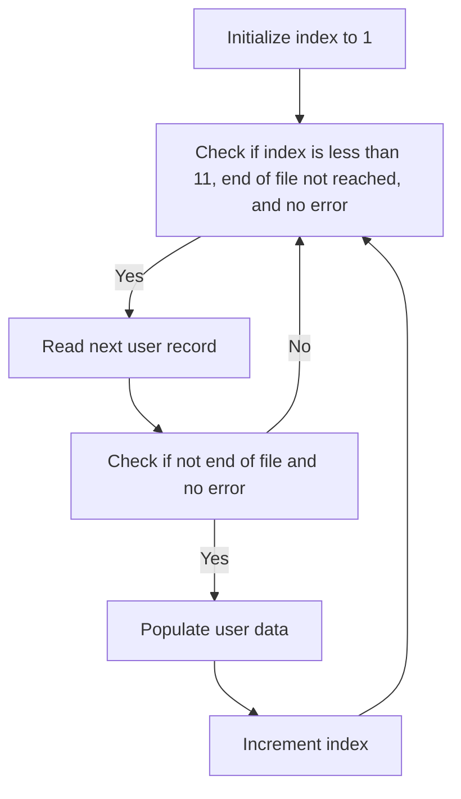

<SwmSnippet path="/COUSR00C/COUSR00C.cbl" line="298">

---

### Loop to Read User Records

Going into the first snippet, the code initializes the index to 1 and then enters a loop. This loop continues until the index reaches 11, the end of the user security file is reached, or an error flag is set. Within the loop, it reads the next user record from the user security file.

```cobol
               MOVE 1             TO  WS-IDX

               PERFORM UNTIL WS-IDX >= 11 OR USER-SEC-EOF OR ERR-FLG-ON
                   PERFORM READNEXT-USER-SEC-FILE
```

---

</SwmSnippet>

<SwmSnippet path="/COUSR00C/COUSR00C.cbl" line="302">

---

### Populating User Data

Now, in the second snippet, if the end of the file has not been reached and no error flag is set, the code populates the user data and increments the index by 1. This ensures that the user data is processed and stored correctly for each user record read from the file.

```cobol
                   IF USER-SEC-NOT-EOF AND ERR-FLG-OFF
                       PERFORM POPULATE-USER-DATA
                       COMPUTE WS-IDX = WS-IDX + 1
                   END-IF
```

---

</SwmSnippet>

## Handle pagination logic

Now, lets zoom into this section of the flow:

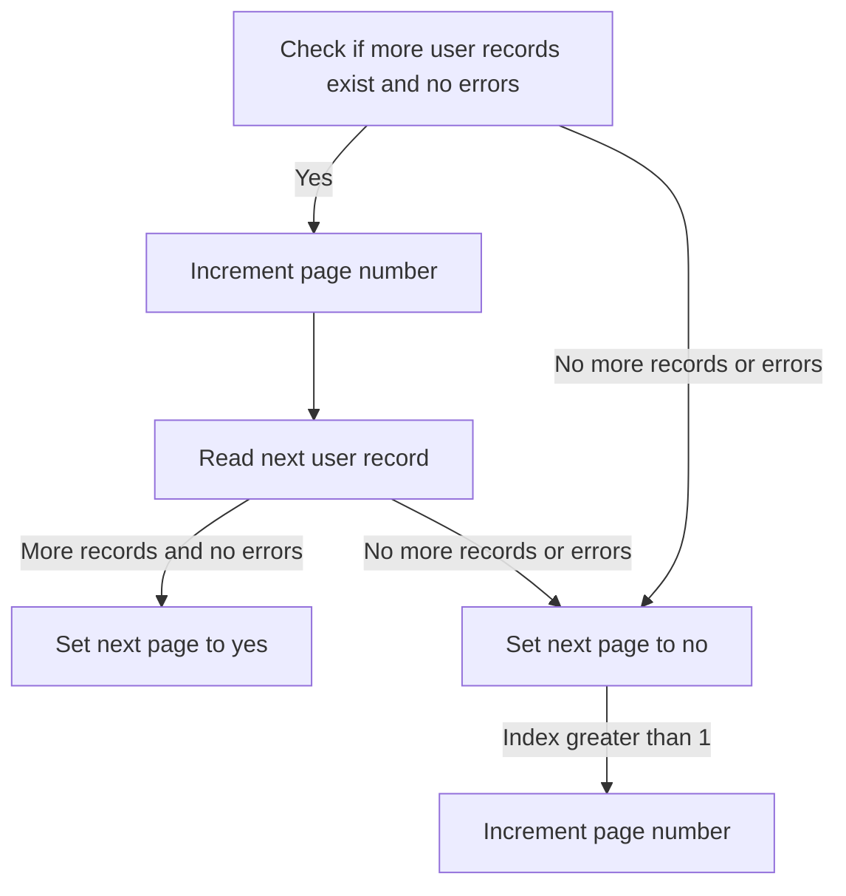

<SwmSnippet path="/COUSR00C/COUSR00C.cbl" line="308">

---

### Handling pagination logic

Going into the first snippet, the code checks if there are more user records to process and no errors have occurred. If both conditions are met, it increments the page number and reads the next user record. If there are still more records and no errors, it sets the flag to indicate that there is a next page. Otherwise, it sets the flag to indicate that there is no next page.

```cobol
               IF USER-SEC-NOT-EOF AND ERR-FLG-OFF
                   COMPUTE CDEMO-CU00-PAGE-NUM =
                           CDEMO-CU00-PAGE-NUM + 1
                   PERFORM READNEXT-USER-SEC-FILE
                   IF USER-SEC-NOT-EOF AND ERR-FLG-OFF
                       SET NEXT-PAGE-YES TO TRUE
                   ELSE
                       SET NEXT-PAGE-NO TO TRUE
                   END-IF
```

---

</SwmSnippet>

<SwmSnippet path="/COUSR00C/COUSR00C.cbl" line="317">

---

### Handling end of pagination

Next, the second snippet handles the scenario where there are no more user records or an error has occurred. It sets the flag to indicate that there is no next page. Additionally, if the index is greater than 1, it increments the page number.

```cobol
               ELSE
                   SET NEXT-PAGE-NO TO TRUE
                   IF WS-IDX > 1
                       COMPUTE CDEMO-CU00-PAGE-NUM = CDEMO-CU00-PAGE-NUM
                        + 1
                   END-IF
               END-IF
```

---

</SwmSnippet>

## End reading records

<SwmSnippet path="/COUSR00C/COUSR00C.cbl" line="325">

---

### Ending the user security file read

Going into the snippet, the <SwmToken path="COUSR00C/COUSR00C.cbl" pos="325:1:9" line-data="               PERFORM ENDBR-USER-SEC-FILE">`PERFORM ENDBR-USER-SEC-FILE`</SwmToken> statement is used to close the user security file after all necessary user records have been processed. This ensures that the file is properly closed and resources are released, maintaining the integrity of the file system.

```cobol
               PERFORM ENDBR-USER-SEC-FILE
```

---

</SwmSnippet>

## Send user list screen

<SwmSnippet path="/COUSR00C/COUSR00C.cbl" line="327">

---

### Sending user list screen

Next, the code updates the current page number and clears the user ID input field. It then performs the logic to send the user list screen to the user.

```cobol
               MOVE CDEMO-CU00-PAGE-NUM TO PAGENUMI  OF COUSR0AI
               MOVE SPACE   TO USRIDINO  OF COUSR0AO
               PERFORM SEND-USRLST-SCREEN
```

---

</SwmSnippet>

# Start reading user security file (<SwmToken path="COUSR00C/COUSR00C.cbl" pos="284:3:9" line-data="           PERFORM STARTBR-USER-SEC-FILE">`STARTBR-USER-SEC-FILE`</SwmToken>)

Lets' zoom into the program flow:

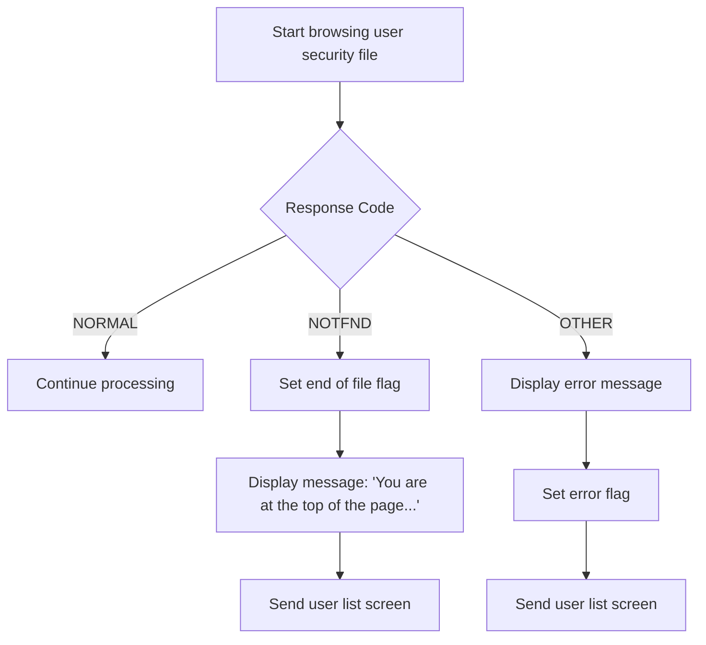

<SwmSnippet path="/COUSR00C/COUSR00C.cbl" line="586">

---

### Starting the browse operation

Going into the <SwmToken path="COUSR00C/COUSR00C.cbl" pos="586:1:7" line-data="       STARTBR-USER-SEC-FILE.">`STARTBR-USER-SEC-FILE`</SwmToken> function, the code initiates a browse operation on the user security file based on the user ID. The response codes from this operation are stored for further evaluation.

```cobol
       STARTBR-USER-SEC-FILE.

           EXEC CICS STARTBR
                DATASET   (WS-USRSEC-FILE)
                RIDFLD    (SEC-USR-ID)
                KEYLENGTH (LENGTH OF SEC-USR-ID)
      *         GTEQ
                RESP      (WS-RESP-CD)
                RESP2     (WS-REAS-CD)
           END-EXEC.
```

---

</SwmSnippet>

<SwmSnippet path="/COUSR00C/COUSR00C.cbl" line="597">

---

### Evaluating the response code

Next, the code evaluates the response code from the browse operation. If the response indicates a normal operation, it continues processing. If the response indicates that no records were found, it sets the end of file flag, displays a message indicating that the user is at the top of the page, and sends the user list screen. For any other response, it displays an error message, sets the error flag, and sends the user list screen.

```cobol
           EVALUATE WS-RESP-CD
               WHEN DFHRESP(NORMAL)
                   CONTINUE
               WHEN DFHRESP(NOTFND)
                   CONTINUE
                   SET USER-SEC-EOF TO TRUE
                   MOVE 'You are at the top of the page...' TO
                                   WS-MESSAGE
                   MOVE -1       TO USRIDINL OF COUSR0AI
                   PERFORM SEND-USRLST-SCREEN
               WHEN OTHER
                   DISPLAY 'RESP:' WS-RESP-CD 'REAS:' WS-REAS-CD
                   MOVE 'Y'     TO WS-ERR-FLG
                   MOVE 'Unable to lookup User...' TO
                                   WS-MESSAGE
                   MOVE -1       TO USRIDINL OF COUSR0AI
                   PERFORM SEND-USRLST-SCREEN
           END-EVALUATE.
```

---

</SwmSnippet>

# Send user list screen (<SwmToken path="COUSR00C/COUSR00C.cbl" pos="119:3:7" line-data="                   PERFORM SEND-USRLST-SCREEN">`SEND-USRLST-SCREEN`</SwmToken>)

Lets' zoom into the program flow:

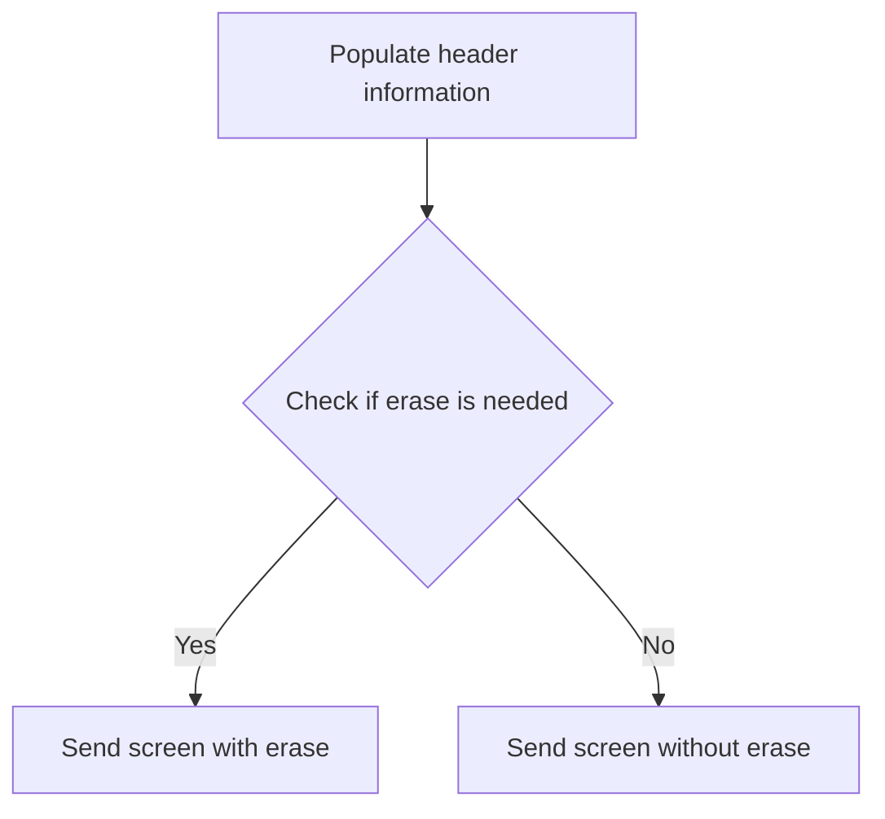

<SwmSnippet path="/COUSR00C/COUSR00C.cbl" line="522">

---

### Populating Header Information

Going into the <SwmToken path="COUSR00C/COUSR00C.cbl" pos="522:1:5" line-data="       SEND-USRLST-SCREEN.">`SEND-USRLST-SCREEN`</SwmToken> function, the first step is to populate the header information. This is done by calling the <SwmToken path="COUSR00C/COUSR00C.cbl" pos="524:3:7" line-data="           PERFORM POPULATE-HEADER-INFO">`POPULATE-HEADER-INFO`</SwmToken> function, which fills in details such as the current date, time, transaction ID, program name, and titles. This ensures that the user list screen displays the correct contextual information at the top.

```cobol
       SEND-USRLST-SCREEN.

           PERFORM POPULATE-HEADER-INFO
```

---

</SwmSnippet>

<SwmSnippet path="/COUSR00C/COUSR00C.cbl" line="526">

---

### Sending the User List Screen

Next, the function moves the message stored in <SwmToken path="COUSR00C/COUSR00C.cbl" pos="526:3:5" line-data="           MOVE WS-MESSAGE TO ERRMSGO OF COUSR0AO">`WS-MESSAGE`</SwmToken> to the error message field <SwmToken path="COUSR00C/COUSR00C.cbl" pos="526:9:9" line-data="           MOVE WS-MESSAGE TO ERRMSGO OF COUSR0AO">`ERRMSGO`</SwmToken> of the screen map <SwmToken path="COUSR00C/COUSR00C.cbl" pos="526:13:13" line-data="           MOVE WS-MESSAGE TO ERRMSGO OF COUSR0AO">`COUSR0AO`</SwmToken>. Then, it checks if the <SwmToken path="COUSR00C/COUSR00C.cbl" pos="528:3:7" line-data="           IF SEND-ERASE-YES">`SEND-ERASE-YES`</SwmToken> flag is set. If it is, the screen is sent with the erase option, clearing any previous content. If the flag is not set, the screen is sent without erasing the previous content. This ensures that the user list screen is displayed correctly based on the current context and any error messages are shown appropriately.

```cobol
           MOVE WS-MESSAGE TO ERRMSGO OF COUSR0AO

           IF SEND-ERASE-YES
               EXEC CICS SEND
                         MAP('COUSR0A')
                         MAPSET('COUSR00')
                         FROM(COUSR0AO)
                         ERASE
                         CURSOR
               END-EXEC
           ELSE
               EXEC CICS SEND
                         MAP('COUSR0A')
                         MAPSET('COUSR00')
                         FROM(COUSR0AO)
      *                  ERASE
                         CURSOR
               END-EXEC
           END-IF.
```

---

</SwmSnippet>

# Populate Header Information (<SwmToken path="COUSR00C/COUSR00C.cbl" pos="524:3:7" line-data="           PERFORM POPULATE-HEADER-INFO">`POPULATE-HEADER-INFO`</SwmToken>)

<SwmSnippet path="/COUSR00C/COUSR00C.cbl" line="562">

---

### Populating Header Information

Going into the <SwmToken path="COUSR00C/COUSR00C.cbl" pos="562:1:5" line-data="       POPULATE-HEADER-INFO.">`POPULATE-HEADER-INFO`</SwmToken> function, the code first retrieves the current date and time. It then populates various header fields with this information, including the transaction ID and program name. The current date is formatted and moved to the appropriate output field, followed by the current time. This ensures that the header contains accurate and up-to-date information for the user listing.

```cobol
       POPULATE-HEADER-INFO.

           MOVE FUNCTION CURRENT-DATE  TO WS-CURDATE-DATA

           MOVE CCDA-TITLE01           TO TITLE01O OF COUSR0AO
           MOVE CCDA-TITLE02           TO TITLE02O OF COUSR0AO
           MOVE WS-TRANID              TO TRNNAMEO OF COUSR0AO
           MOVE WS-PGMNAME             TO PGMNAMEO OF COUSR0AO

           MOVE WS-CURDATE-MONTH       TO WS-CURDATE-MM
           MOVE WS-CURDATE-DAY         TO WS-CURDATE-DD
           MOVE WS-CURDATE-YEAR(3:2)   TO WS-CURDATE-YY

           MOVE WS-CURDATE-MM-DD-YY    TO CURDATEO OF COUSR0AO

           MOVE WS-CURTIME-HOURS       TO WS-CURTIME-HH
           MOVE WS-CURTIME-MINUTE      TO WS-CURTIME-MM
           MOVE WS-CURTIME-SECOND      TO WS-CURTIME-SS

           MOVE WS-CURTIME-HH-MM-SS    TO CURTIMEO OF COUSR0AO.
```

---

</SwmSnippet>

# Read Next User Record (<SwmToken path="COUSR00C/COUSR00C.cbl" pos="301:3:9" line-data="                   PERFORM READNEXT-USER-SEC-FILE">`READNEXT-USER-SEC-FILE`</SwmToken>)

Lets' zoom into the program flow:

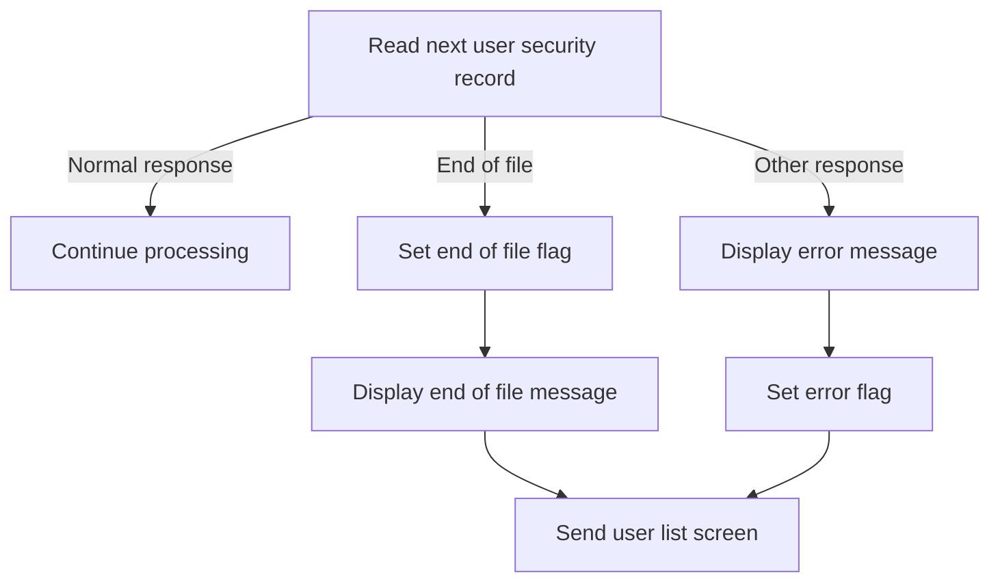

<SwmSnippet path="/COUSR00C/COUSR00C.cbl" line="619">

---

### Reading the next user security record

Going into the <SwmToken path="COUSR00C/COUSR00C.cbl" pos="619:1:7" line-data="       READNEXT-USER-SEC-FILE.">`READNEXT-USER-SEC-FILE`</SwmToken> function, the code reads the next record from the user security file. It fetches the next user security data and stores the response and reason codes for further evaluation.

```cobol
       READNEXT-USER-SEC-FILE.

           EXEC CICS READNEXT
                DATASET   (WS-USRSEC-FILE)
                INTO      (SEC-USER-DATA)
                LENGTH    (LENGTH OF SEC-USER-DATA)
                RIDFLD    (SEC-USR-ID)
                KEYLENGTH (LENGTH OF SEC-USR-ID)
                RESP      (WS-RESP-CD)
                RESP2     (WS-REAS-CD)
           END-EXEC.
```

---

</SwmSnippet>

<SwmSnippet path="/COUSR00C/COUSR00C.cbl" line="631">

---

### Evaluating the response code

Next, the code evaluates the response code. If the response indicates a normal operation, it continues processing. If it indicates the end of the file, it sets the end of file flag, displays an end of list message, and sends the user list screen. For any other response, it displays an error message, sets the error flag, and sends the user list screen.

```cobol
           EVALUATE WS-RESP-CD
               WHEN DFHRESP(NORMAL)
                   CONTINUE
               WHEN DFHRESP(ENDFILE)
                   CONTINUE
                   SET USER-SEC-EOF TO TRUE
                   MOVE 'You have reached the bottom of the page...' TO
                                   WS-MESSAGE
                   MOVE -1       TO USRIDINL OF COUSR0AI
                   PERFORM SEND-USRLST-SCREEN
               WHEN OTHER
                   DISPLAY 'RESP:' WS-RESP-CD 'REAS:' WS-REAS-CD
                   MOVE 'Y'     TO WS-ERR-FLG
                   MOVE 'Unable to lookup User...' TO
                                   WS-MESSAGE
                   MOVE -1       TO USRIDINL OF COUSR0AI
                   PERFORM SEND-USRLST-SCREEN
           END-EVALUATE.
```

---

</SwmSnippet>

# Receive user input (<SwmToken path="COUSR00C/COUSR00C.cbl" pos="121:3:7" line-data="                   PERFORM RECEIVE-USRLST-SCREEN">`RECEIVE-USRLST-SCREEN`</SwmToken>)

<SwmSnippet path="/COUSR00C/COUSR00C.cbl" line="549">

---

### Receiving user list screen data

The <SwmToken path="COUSR00C/COUSR00C.cbl" pos="549:1:5" line-data="       RECEIVE-USRLST-SCREEN.">`RECEIVE-USRLST-SCREEN`</SwmToken> function receives data from the user list screen. It uses the CICS RECEIVE command to get the data from the specified map and mapset, storing the received data into a designated area for further processing.

```cobol
       RECEIVE-USRLST-SCREEN.

           EXEC CICS RECEIVE
                     MAP('COUSR0A')
                     MAPSET('COUSR00')
                     INTO(COUSR0AI)
                     RESP(WS-RESP-CD)
                     RESP2(WS-REAS-CD)
           END-EXEC.
```

---

</SwmSnippet>

&nbsp;

*This is an auto-generated document by Swimm 🌊 and has not yet been verified by a human*

<SwmMeta version="3.0.0" repo-id="Z2l0aHViJTNBJTNBb3BlbmxlZ2FjeWRlbW8lM0ElM0FTd2ltbS1EZW1v" repo-name="openlegacydemo"><sup>Powered by [Swimm](/)</sup></SwmMeta>
