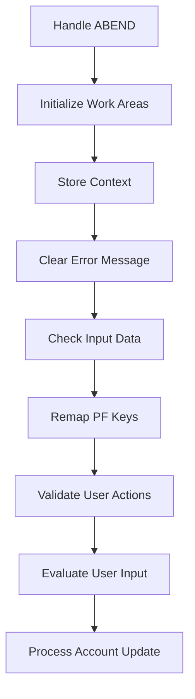
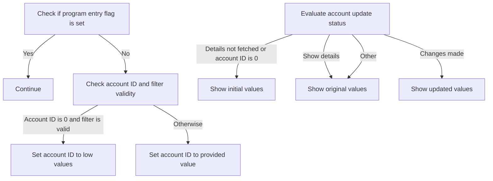
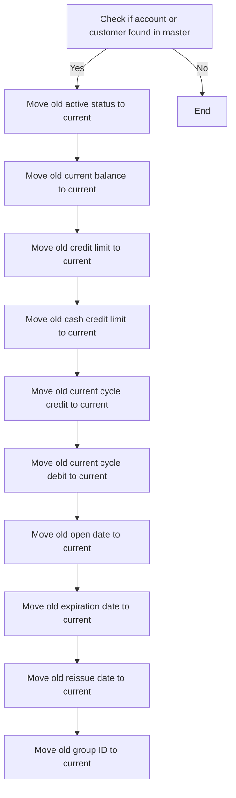
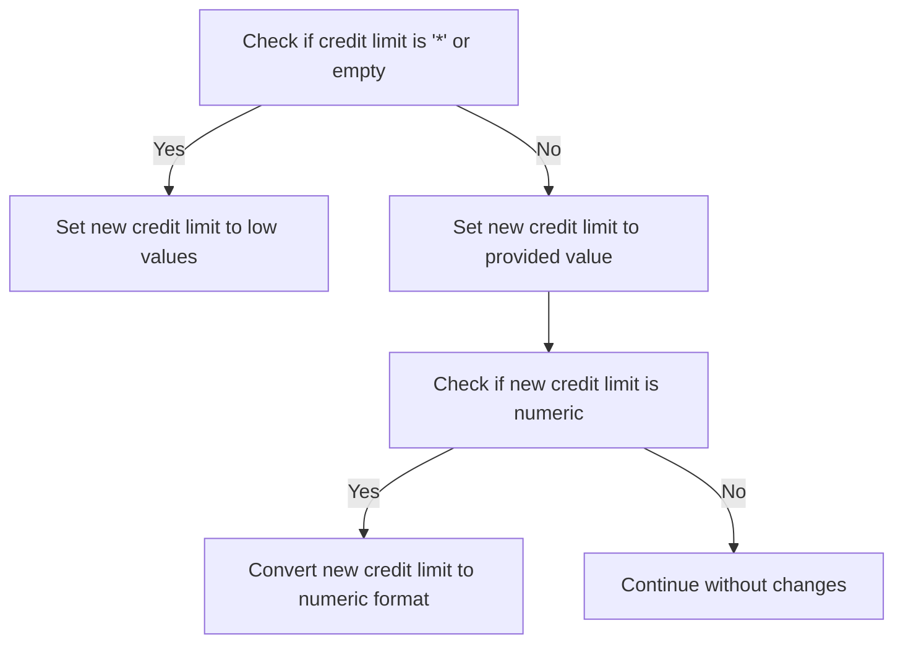
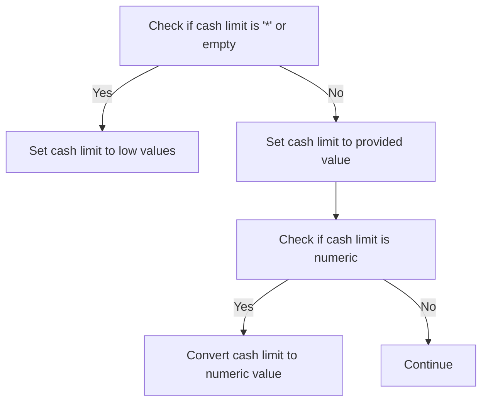
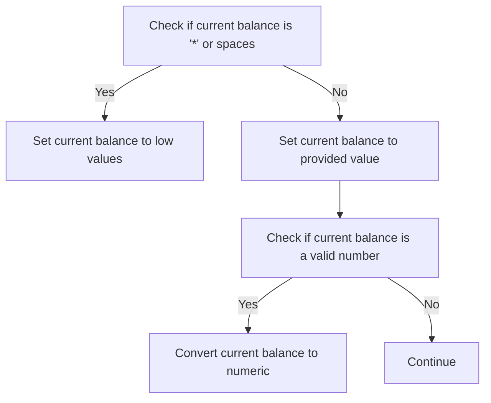
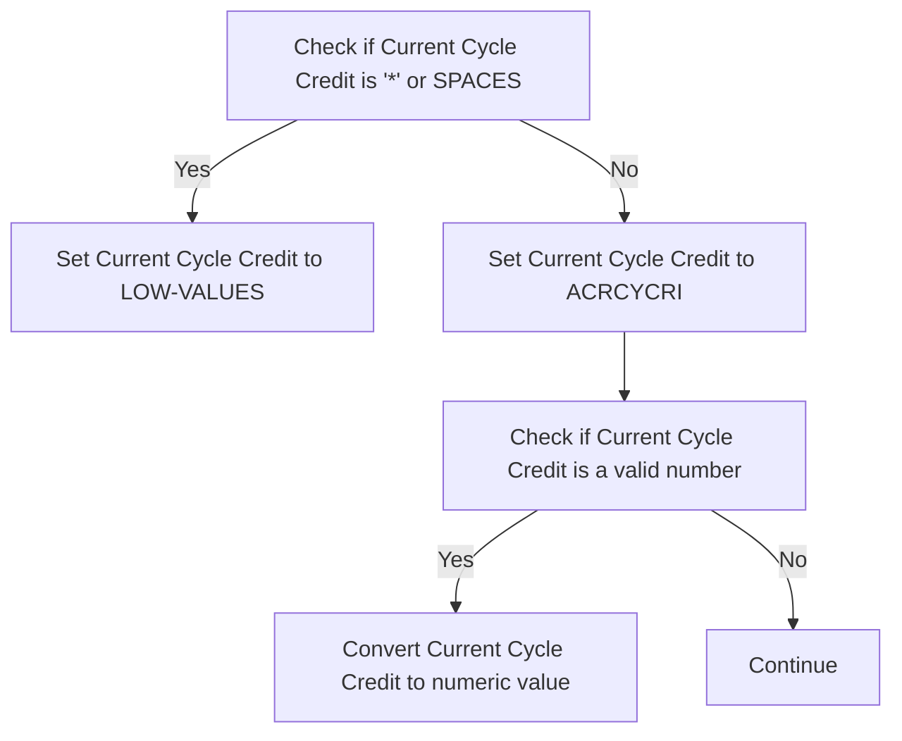
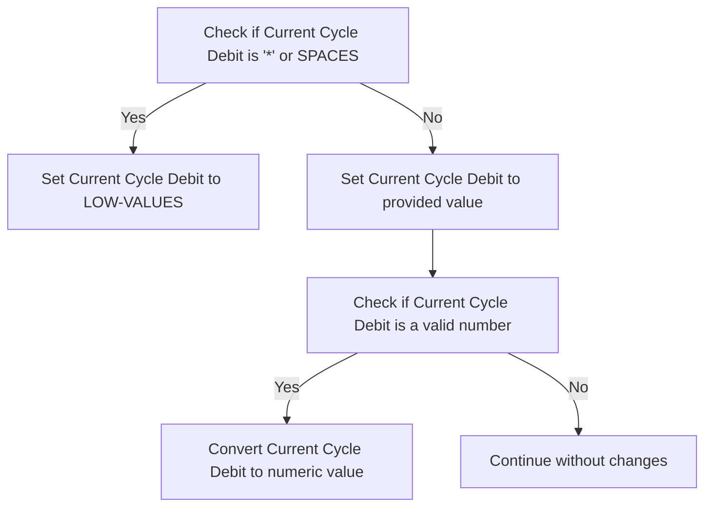

```mermaid
graph TD
  A[Evaluate Conditions] -->|CDEMO-PGM-ENTER| B[Prompt for Search Keys]
  A -->|ACUP-DETAILS-NOT-FETCHED| B
  A -->|ACUP-SHOW-DETAILS| C[Prompt for Changes]
  A -->|ACUP-CHANGES-NOT-OK| C
  A -->|ACUP-CHANGES-OK-NOT-CONFIRMED| D[Prompt for Confirmation]
  A -->|ACUP-CHANGES-OKAYED-AND-DONE| E[Confirm Update Success]
  A -->|ACUP-CHANGES-OKAYED-LOCK-ERROR| F[Inform Failure]
  A -->|ACUP-CHANGES-OKAYED-BUT-FAILED| F
  A -->|WS-NO-INFO-MESSAGE| B

%% Swimm:
%% graph TD
%%   A[Evaluate Conditions] -->|<SwmToken path="COACTUPC/COACTUPC.cbl" pos="2700:3:7" line-data="           IF CDEMO-PGM-ENTER">`CDEMO-PGM-ENTER`</SwmToken>| B[Prompt for Search Keys]
%%   A -->|<SwmToken path="COACTUPC/COACTUPC.cbl" pos="2711:3:9" line-data="                WHEN ACUP-DETAILS-NOT-FETCHED">`ACUP-DETAILS-NOT-FETCHED`</SwmToken>| B
%%   A -->|<SwmToken path="COACTUPC/COACTUPC.cbl" pos="2715:3:7" line-data="               WHEN ACUP-SHOW-DETAILS">`ACUP-SHOW-DETAILS`</SwmToken>| C[Prompt for Changes]
%%   A -->|<SwmToken path="COACTUPC/COACTUPC.cbl" pos="2964:3:9" line-data="               WHEN ACUP-CHANGES-NOT-OK">`ACUP-CHANGES-NOT-OK`</SwmToken>| C
%%   A -->|<SwmToken path="COACTUPC/COACTUPC.cbl" pos="2966:3:11" line-data="               WHEN ACUP-CHANGES-OK-NOT-CONFIRMED">`ACUP-CHANGES-OK-NOT-CONFIRMED`</SwmToken>| D[Prompt for Confirmation]
%%   A -->|<SwmToken path="COACTUPC/COACTUPC.cbl" pos="2968:3:11" line-data="               WHEN ACUP-CHANGES-OKAYED-AND-DONE">`ACUP-CHANGES-OKAYED-AND-DONE`</SwmToken>| E[Confirm Update Success]
%%   A -->|<SwmToken path="COACTUPC/COACTUPC.cbl" pos="2971:3:11" line-data="               WHEN ACUP-CHANGES-OKAYED-LOCK-ERROR">`ACUP-CHANGES-OKAYED-LOCK-ERROR`</SwmToken>| F[Inform Failure]
%%   A -->|<SwmToken path="COACTUPC/COACTUPC.cbl" pos="2973:3:11" line-data="               WHEN ACUP-CHANGES-OKAYED-BUT-FAILED">`ACUP-CHANGES-OKAYED-BUT-FAILED`</SwmToken>| F
%%   A -->|<SwmToken path="COACTUPC/COACTUPC.cbl" pos="2975:3:9" line-data="               WHEN WS-NO-INFO-MESSAGE">`WS-NO-INFO-MESSAGE`</SwmToken>| B
```

The COACTUPC program is responsible for accepting and processing account updates within the business logic layer. This is achieved by handling various steps such as initializing work areas, validating user actions, and processing the account update itself. The program flow starts with handling any unexpected errors, followed by initializing necessary work areas and storing context. It then clears any error messages, checks input data, remaps PF keys, validates user actions, evaluates user input, and finally processes the account update.

For instance, when a user updates their account information, the COACTUPC program will validate the input data, ensure all necessary fields are correctly formatted, and then update the account information accordingly. If the user provides an invalid account ID, the program will set it to a default low value to prevent processing errors.

# Process account update (<SwmToken path="COACTUPC/COACTUPC.cbl" pos="859:1:3" line-data="       0000-MAIN.">`0000-MAIN`</SwmToken>)

Lets' zoom into the program flow:



<SwmSnippet path="/COACTUPC/COACTUPC.cbl" line="859">

---

### Handling ABEND

Going into the first snippet, the code sets up an error handler to manage any unexpected errors that occur during execution.

```cobol
       0000-MAIN.


           EXEC CICS HANDLE ABEND
                     LABEL(ABEND-ROUTINE)
           END-EXEC
```

---

</SwmSnippet>

# Send Account Update Screen (<SwmToken path="COACTUPC/COACTUPC.cbl" pos="2649:1:5" line-data="       3000-SEND-MAP.">`3000-SEND-MAP`</SwmToken>)

<SwmSnippet path="/COACTUPC/COACTUPC.cbl" line="2649">

---

### Sending the updated account information screen

The <SwmToken path="COACTUPC/COACTUPC.cbl" pos="2649:1:5" line-data="       3000-SEND-MAP.">`3000-SEND-MAP`</SwmToken> function is responsible for sending the updated account information screen to the user. It initializes the screen, prepares the necessary variables, sets up information messages, configures screen attributes, and finally sends the screen to update the account information.

```cobol
       3000-SEND-MAP.
           PERFORM 3100-SCREEN-INIT
              THRU 3100-SCREEN-INIT-EXIT
           PERFORM 3200-SETUP-SCREEN-VARS
              THRU 3200-SETUP-SCREEN-VARS-EXIT
           PERFORM 3250-SETUP-INFOMSG
              THRU 3250-SETUP-INFOMSG-EXIT
           PERFORM 3300-SETUP-SCREEN-ATTRS
              THRU 3300-SETUP-SCREEN-ATTRS-EXIT
           PERFORM 3390-SETUP-INFOMSG-ATTRS
              THRU 3390-SETUP-INFOMSG-ATTRS-EXIT
           PERFORM 3400-SEND-SCREEN
              THRU 3400-SEND-SCREEN-EXIT
```

---

</SwmSnippet>

# Initialize Screen Data (<SwmToken path="COACTUPC/COACTUPC.cbl" pos="2650:3:7" line-data="           PERFORM 3100-SCREEN-INIT">`3100-SCREEN-INIT`</SwmToken>)

<SwmSnippet path="/COACTUPC/COACTUPC.cbl" line="2668">

---

### Initializing Screen Data

The <SwmToken path="COACTUPC/COACTUPC.cbl" pos="2668:1:5" line-data="       3100-SCREEN-INIT.">`3100-SCREEN-INIT`</SwmToken> function initializes the screen with the current date and time. It starts by setting default values to the <SwmToken path="COACTUPC/COACTUPC.cbl" pos="2669:9:9" line-data="           MOVE LOW-VALUES TO CACTUPAO">`CACTUPAO`</SwmToken> variable. Then, it retrieves the current date and time, formats them, and assigns these values to the respective fields in <SwmToken path="COACTUPC/COACTUPC.cbl" pos="2669:9:9" line-data="           MOVE LOW-VALUES TO CACTUPAO">`CACTUPAO`</SwmToken>. This ensures that the screen displays the correct date and time when it is initialized.

```cobol
       3100-SCREEN-INIT.
           MOVE LOW-VALUES TO CACTUPAO

           MOVE FUNCTION CURRENT-DATE     TO WS-CURDATE-DATA

           MOVE CCDA-TITLE01              TO TITLE01O OF CACTUPAO
           MOVE CCDA-TITLE02              TO TITLE02O OF CACTUPAO
           MOVE LIT-THISTRANID            TO TRNNAMEO OF CACTUPAO
           MOVE LIT-THISPGM               TO PGMNAMEO OF CACTUPAO

           MOVE FUNCTION CURRENT-DATE     TO WS-CURDATE-DATA

           MOVE WS-CURDATE-MONTH          TO WS-CURDATE-MM
           MOVE WS-CURDATE-DAY            TO WS-CURDATE-DD
           MOVE WS-CURDATE-YEAR(3:2)      TO WS-CURDATE-YY

           MOVE WS-CURDATE-MM-DD-YY       TO CURDATEO OF CACTUPAO

           MOVE WS-CURTIME-HOURS          TO WS-CURTIME-HH
           MOVE WS-CURTIME-MINUTE         TO WS-CURTIME-MM
           MOVE WS-CURTIME-SECOND         TO WS-CURTIME-SS

           MOVE WS-CURTIME-HH-MM-SS       TO CURTIMEO OF CACTUPAO

           .
```

---

</SwmSnippet>

# Setup Screen Variables (<SwmToken path="COACTUPC/COACTUPC.cbl" pos="2652:3:9" line-data="           PERFORM 3200-SETUP-SCREEN-VARS">`3200-SETUP-SCREEN-VARS`</SwmToken>)

Lets' zoom into the program flow:



<SwmSnippet path="/COACTUPC/COACTUPC.cbl" line="2698">

---

### Initializing Search Criteria

Going into the first snippet, the code checks if the program entry flag is set. If it is, the program continues without any changes. Otherwise, it checks if the account ID is zero and if the account filter is valid. If both conditions are met, it sets the account ID to low values, indicating a reset or initialization state. If not, it sets the account ID to the provided value, ensuring that the correct account is referenced for further processing.

```cobol
       3200-SETUP-SCREEN-VARS.
      *    INITIALIZE SEARCH CRITERIA
           IF CDEMO-PGM-ENTER
              CONTINUE
           ELSE
              IF CC-ACCT-ID-N = 0
              AND FLG-ACCTFILTER-ISVALID
                 MOVE LOW-VALUES                TO ACCTSIDO OF CACTUPAO
              ELSE
                 MOVE CC-ACCT-ID                TO ACCTSIDO OF CACTUPAO
              END-IF
```

---

</SwmSnippet>

<SwmSnippet path="/COACTUPC/COACTUPC.cbl" line="2710">

---

### Evaluating Account Update Status

Next, the code evaluates the status of the account update process. If the details have not been fetched or the account ID is zero, it performs the routine to show initial values. If the status indicates that details should be shown, it performs the routine to display the original values. If changes have been made, it performs the routine to show the updated values. For any other status, it defaults to showing the original values. This ensures that the correct information is displayed based on the current state of the account update process.

```cobol
              EVALUATE TRUE
                WHEN ACUP-DETAILS-NOT-FETCHED
                WHEN CC-ACCT-ID-N =  0
                  PERFORM 3201-SHOW-INITIAL-VALUES
                     THRU 3201-SHOW-INITIAL-VALUES-EXIT
               WHEN ACUP-SHOW-DETAILS
                  PERFORM 3202-SHOW-ORIGINAL-VALUES
                     THRU 3202-SHOW-ORIGINAL-VALUES-EXIT
               WHEN ACUP-CHANGES-MADE
                  PERFORM 3203-SHOW-UPDATED-VALUES
                     THRU 3203-SHOW-UPDATED-VALUES-EXIT
               WHEN OTHER
                  PERFORM 3202-SHOW-ORIGINAL-VALUES
                     THRU 3202-SHOW-ORIGINAL-VALUES-EXIT
              END-EVALUATE
            END-IF
           .
```

---

</SwmSnippet>

# Set initial values (<SwmToken path="COACTUPC/COACTUPC.cbl" pos="2713:3:9" line-data="                  PERFORM 3201-SHOW-INITIAL-VALUES">`3201-SHOW-INITIAL-VALUES`</SwmToken>)

<SwmSnippet path="/COACTUPC/COACTUPC.cbl" line="2731">

---

### Displaying Initial Values

Going into the <SwmToken path="COACTUPC/COACTUPC.cbl" pos="2731:1:7" line-data="       3201-SHOW-INITIAL-VALUES.">`3201-SHOW-INITIAL-VALUES`</SwmToken> function, it initializes various fields related to account and customer information to their default low values. This step ensures that all fields are reset before any new data is processed or displayed.

```cobol
       3201-SHOW-INITIAL-VALUES.
           MOVE LOW-VALUES                     TO  ACSTTUSO OF CACTUPAO
                                                   ACRDLIMO OF CACTUPAO
      *Account Limits
                                                   ACURBALO OF CACTUPAO
                                                   ACSHLIMO OF CACTUPAO
                                                   ACRCYCRO OF CACTUPAO
                                                   ACRCYDBO OF CACTUPAO
      *Account Dates
                                                   OPNYEARO OF CACTUPAO
                                                   OPNMONO  OF CACTUPAO
                                                   OPNDAYO  OF CACTUPAO
                                                   EXPYEARO OF CACTUPAO
                                                   EXPMONO  OF CACTUPAO
                                                   EXPDAYO  OF CACTUPAO
                                                   RISYEARO OF CACTUPAO
                                                   RISMONO  OF CACTUPAO
                                                   RISDAYO  OF CACTUPAO
                                                   AADDGRPO OF CACTUPAO
      *Customer data
                                                   ACSTNUMO OF CACTUPAO
                                                   ACTSSN1O OF CACTUPAO
                                                   ACTSSN2O OF CACTUPAO
                                                   ACTSSN3O OF CACTUPAO
                                                   ACSTFCOO OF CACTUPAO
                                                   DOBYEARO OF CACTUPAO
                                                   DOBMONO  OF CACTUPAO
                                                   DOBDAYO  OF CACTUPAO
                                                   ACSFNAMO OF CACTUPAO
                                                   ACSMNAMO OF CACTUPAO
                                                   ACSLNAMO OF CACTUPAO
      *Customer address and contact info
                                                   ACSADL1O OF CACTUPAO
                                                   ACSADL2O OF CACTUPAO
                                                   ACSCITYO OF CACTUPAO
                                                   ACSSTTEO OF CACTUPAO
                                                   ACSZIPCO OF CACTUPAO
                                                   ACSCTRYO OF CACTUPAO

                                                   ACSPH1AO OF CACTUPAO
                                                   ACSPH1BO OF CACTUPAO
                                                   ACSPH1CO OF CACTUPAO
                                                   ACSPH2AO OF CACTUPAO
                                                   ACSPH2BO OF CACTUPAO
                                                   ACSPH2CO OF CACTUPAO

      *Customer other good stuff
                                                   ACSGOVTO OF CACTUPAO
                                                   ACSEFTCO OF CACTUPAO
                                                   ACSPFLGO OF CACTUPAO
           .
```

---

</SwmSnippet>

# Show Original Values (<SwmToken path="COACTUPC/COACTUPC.cbl" pos="2716:3:9" line-data="                  PERFORM 3202-SHOW-ORIGINAL-VALUES">`3202-SHOW-ORIGINAL-VALUES`</SwmToken>)

Lets' zoom into the program flow:



<SwmSnippet path="/COACTUPC/COACTUPC.cbl" line="2787">

---

### Initializing Non-Key Flags and Prompting for Changes

Going into the first snippet, the code prepares the system to prompt the user for changes by setting the necessary flags.

```cobol
       3202-SHOW-ORIGINAL-VALUES.

           MOVE LOW-VALUES                     TO WS-NON-KEY-FLAGS

           SET PROMPT-FOR-CHANGES              TO TRUE
```

---

</SwmSnippet>

<SwmSnippet path="/COACTUPC/COACTUPC.cbl" line="2793">

---

### Moving Old Account Values to Current

Next, the code checks if either an account or a customer is found in the master record. If found, it updates the current account fields with the old values, ensuring that the original data is displayed.

```cobol
           IF FOUND-ACCT-IN-MASTER
           OR FOUND-CUST-IN-MASTER
              MOVE ACUP-OLD-ACTIVE-STATUS      TO ACSTTUSO OF CACTUPAO

              MOVE ACUP-OLD-CURR-BAL-N         TO WS-EDIT-CURRENCY-9-2-F
              MOVE WS-EDIT-CURRENCY-9-2-F      TO ACURBALO OF CACTUPAO

              MOVE ACUP-OLD-CREDIT-LIMIT-N     TO WS-EDIT-CURRENCY-9-2-F
              MOVE WS-EDIT-CURRENCY-9-2-F      TO ACRDLIMO OF CACTUPAO

              MOVE ACUP-OLD-CASH-CREDIT-LIMIT-N
                                               TO WS-EDIT-CURRENCY-9-2-F
              MOVE WS-EDIT-CURRENCY-9-2-F      TO ACSHLIMO OF CACTUPAO

              MOVE ACUP-OLD-CURR-CYC-CREDIT-N  TO WS-EDIT-CURRENCY-9-2-F
              MOVE WS-EDIT-CURRENCY-9-2-F      TO ACRCYCRO OF CACTUPAO

              MOVE ACUP-OLD-CURR-CYC-DEBIT-N   TO WS-EDIT-CURRENCY-9-2-F
              MOVE WS-EDIT-CURRENCY-9-2-F      TO ACRCYDBO OF CACTUPAO

              MOVE ACUP-OLD-OPEN-YEAR          TO OPNYEARO OF CACTUPAO
              MOVE ACUP-OLD-OPEN-MON           TO OPNMONO  OF CACTUPAO
              MOVE ACUP-OLD-OPEN-DAY           TO OPNDAYO  OF CACTUPAO

              MOVE ACUP-OLD-EXP-YEAR           TO EXPYEARO OF CACTUPAO
              MOVE ACUP-OLD-EXP-MON            TO EXPMONO  OF CACTUPAO
              MOVE ACUP-OLD-EXP-DAY            TO EXPDAYO  OF CACTUPAO

              MOVE ACUP-OLD-REISSUE-YEAR       TO RISYEARO OF CACTUPAO
              MOVE ACUP-OLD-REISSUE-MON        TO RISMONO  OF CACTUPAO
              MOVE ACUP-OLD-REISSUE-DAY        TO RISDAYO  OF CACTUPAO
              MOVE ACUP-OLD-GROUP-ID           TO AADDGRPO OF CACTUPAO
           END-IF
```

---

</SwmSnippet>

<SwmSnippet path="/COACTUPC/COACTUPC.cbl" line="2828">

---

### Moving Old Customer Values to Current

Then, the code updates the current customer fields with the old values, ensuring that the original customer data is displayed.

```cobol
              MOVE ACUP-OLD-CUST-ID-X          TO ACSTNUMO OF CACTUPAO
              MOVE ACUP-OLD-CUST-SSN-X(1:3)    TO ACTSSN1O OF CACTUPAO
              MOVE ACUP-OLD-CUST-SSN-X(4:2)    TO ACTSSN2O OF CACTUPAO
              MOVE ACUP-OLD-CUST-SSN-X(6:4)    TO ACTSSN3O OF CACTUPAO
              MOVE ACUP-OLD-CUST-FICO-SCORE-X  TO ACSTFCOO OF CACTUPAO
              MOVE ACUP-OLD-CUST-DOB-YEAR      TO DOBYEARO OF CACTUPAO
              MOVE ACUP-OLD-CUST-DOB-MON       TO DOBMONO  OF CACTUPAO
              MOVE ACUP-OLD-CUST-DOB-DAY       TO DOBDAYO  OF CACTUPAO
              MOVE ACUP-OLD-CUST-FIRST-NAME    TO ACSFNAMO OF CACTUPAO
              MOVE ACUP-OLD-CUST-MIDDLE-NAME   TO ACSMNAMO OF CACTUPAO
              MOVE ACUP-OLD-CUST-LAST-NAME     TO ACSLNAMO OF CACTUPAO
              MOVE ACUP-OLD-CUST-ADDR-LINE-1   TO ACSADL1O OF CACTUPAO
              MOVE ACUP-OLD-CUST-ADDR-LINE-2   TO ACSADL2O OF CACTUPAO
              MOVE ACUP-OLD-CUST-ADDR-LINE-3   TO ACSCITYO OF CACTUPAO
              MOVE ACUP-OLD-CUST-ADDR-STATE-CD TO ACSSTTEO OF CACTUPAO
              MOVE ACUP-OLD-CUST-ADDR-ZIP      TO ACSZIPCO OF CACTUPAO
              MOVE ACUP-OLD-CUST-ADDR-COUNTRY-CD
                                               TO ACSCTRYO OF CACTUPAO
              MOVE ACUP-OLD-CUST-PHONE-NUM-1(2:3)
                                               TO ACSPH1AO OF CACTUPAO
              MOVE ACUP-OLD-CUST-PHONE-NUM-1(6:3)
                                               TO ACSPH1BO OF CACTUPAO
              MOVE ACUP-OLD-CUST-PHONE-NUM-1(10:4)
                                               TO ACSPH1CO OF CACTUPAO
              MOVE ACUP-OLD-CUST-PHONE-NUM-2(2:3)
                                               TO ACSPH2AO OF CACTUPAO
              MOVE ACUP-OLD-CUST-PHONE-NUM-2(6:3)
                                               TO ACSPH2BO OF CACTUPAO
              MOVE ACUP-OLD-CUST-PHONE-NUM-2(10:4)
                                               TO ACSPH2CO OF CACTUPAO
              MOVE ACUP-OLD-CUST-GOVT-ISSUED-ID
                                               TO ACSGOVTO OF CACTUPAO
              MOVE ACUP-OLD-CUST-EFT-ACCOUNT-ID
                                               TO ACSEFTCO OF CACTUPAO
              MOVE ACUP-OLD-CUST-PRI-HOLDER-IND
                                               TO ACSPFLGO OF CACTUPAO
           END-IF
           .
```

---

</SwmSnippet>

# Setup Information Message (<SwmToken path="COACTUPC/COACTUPC.cbl" pos="2654:3:7" line-data="           PERFORM 3250-SETUP-INFOMSG">`3250-SETUP-INFOMSG`</SwmToken>)

Lets' zoom into the program flow:



<SwmSnippet path="/COACTUPC/COACTUPC.cbl" line="2955">

---

### Setting up information messages

Going into the <SwmToken path="COACTUPC/COACTUPC.cbl" pos="2955:1:5" line-data="       3250-SETUP-INFOMSG.">`3250-SETUP-INFOMSG`</SwmToken> function, it evaluates various conditions to set up appropriate information messages. Depending on the condition, it prompts the user for search keys, changes, confirmation, or informs them of success or failure.

```cobol
       3250-SETUP-INFOMSG.
      *    SETUP INFORMATION MESSAGE
           EVALUATE TRUE
               WHEN CDEMO-PGM-ENTER
                    SET  PROMPT-FOR-SEARCH-KEYS TO TRUE
               WHEN ACUP-DETAILS-NOT-FETCHED
                   SET PROMPT-FOR-SEARCH-KEYS      TO TRUE
               WHEN ACUP-SHOW-DETAILS
                    SET PROMPT-FOR-CHANGES         TO TRUE
               WHEN ACUP-CHANGES-NOT-OK
                    SET PROMPT-FOR-CHANGES         TO TRUE
               WHEN ACUP-CHANGES-OK-NOT-CONFIRMED
                    SET PROMPT-FOR-CONFIRMATION    TO TRUE
               WHEN ACUP-CHANGES-OKAYED-AND-DONE
                    SET CONFIRM-UPDATE-SUCCESS     TO TRUE

               WHEN ACUP-CHANGES-OKAYED-LOCK-ERROR
                    SET INFORM-FAILURE             TO TRUE
               WHEN ACUP-CHANGES-OKAYED-BUT-FAILED
                    SET INFORM-FAILURE             TO TRUE
               WHEN WS-NO-INFO-MESSAGE
                   SET PROMPT-FOR-SEARCH-KEYS      TO TRUE
           END-EVALUATE
```

---

</SwmSnippet>

<SwmSnippet path="/COACTUPC/COACTUPC.cbl" line="2979">

---

### Moving messages to output fields

Next, the function sets the informational and return messages to their respective output fields in the account update process.

```cobol
           MOVE WS-INFO-MSG                    TO INFOMSGO OF CACTUPAO

           MOVE WS-RETURN-MSG                  TO ERRMSGO OF CACTUPAO
           .
```

---

</SwmSnippet>

# Prepare and Return Data (<SwmToken path="COACTUPC/COACTUPC.cbl" pos="1007:1:3" line-data="       COMMON-RETURN.">`COMMON-RETURN`</SwmToken>)

<SwmSnippet path="/COACTUPC/COACTUPC.cbl" line="1007">

---

### Handling account update returns

Going into the <SwmToken path="COACTUPC/COACTUPC.cbl" pos="1007:1:3" line-data="       COMMON-RETURN.">`COMMON-RETURN`</SwmToken> function, the first step is to move the return message to the error message field. This ensures that any error messages generated during the account update process are properly communicated. Next, the communication area is prepared by combining the existing communication area with the current program's communication area. This step is crucial for maintaining the state and data consistency across different programs. Finally, the function returns control to the calling program, passing along the updated communication area and specifying the transaction ID. This ensures that the calling program can continue processing with the updated state and data.

```cobol
       COMMON-RETURN.
           MOVE WS-RETURN-MSG     TO CCARD-ERROR-MSG

           MOVE  CARDDEMO-COMMAREA    TO WS-COMMAREA
           MOVE  WS-THIS-PROGCOMMAREA TO
                  WS-COMMAREA(LENGTH OF CARDDEMO-COMMAREA + 1:
                               LENGTH OF WS-THIS-PROGCOMMAREA )

           EXEC CICS RETURN
                TRANSID (LIT-THISTRANID)
                COMMAREA (WS-COMMAREA)
                LENGTH(LENGTH OF WS-COMMAREA)
           END-EXEC
```

---

</SwmSnippet>

# Process Inputs (<SwmToken path="COACTUPC/COACTUPC.cbl" pos="1025:1:5" line-data="       1000-PROCESS-INPUTS.">`1000-PROCESS-INPUTS`</SwmToken>)

<SwmSnippet path="/COACTUPC/COACTUPC.cbl" line="1025">

---

### Receiving and Editing Map Inputs

Going into the <SwmToken path="COACTUPC/COACTUPC.cbl" pos="1025:1:5" line-data="       1000-PROCESS-INPUTS.">`1000-PROCESS-INPUTS`</SwmToken> function, the code first performs the <SwmToken path="COACTUPC/COACTUPC.cbl" pos="1026:3:7" line-data="           PERFORM 1100-RECEIVE-MAP">`1100-RECEIVE-MAP`</SwmToken> section, which is responsible for receiving data from a map. This data typically includes account and customer information that needs to be updated. After receiving the data, the function then performs the <SwmToken path="COACTUPC/COACTUPC.cbl" pos="1028:3:9" line-data="           PERFORM 1200-EDIT-MAP-INPUTS">`1200-EDIT-MAP-INPUTS`</SwmToken> section, which processes and validates the input fields. This ensures that all necessary data is correctly formatted and meets the required criteria before proceeding with the account update.

```cobol
       1000-PROCESS-INPUTS.
           PERFORM 1100-RECEIVE-MAP
              THRU 1100-RECEIVE-MAP-EXIT
           PERFORM 1200-EDIT-MAP-INPUTS
              THRU 1200-EDIT-MAP-INPUTS-EXIT
```

---

</SwmSnippet>

<SwmSnippet path="/COACTUPC/COACTUPC.cbl" line="1030">

---

### Setting Return Messages and Next Steps

Next, the function sets various fields to prepare for the next steps in the process. It moves the return message to the error message field, ensuring that any issues encountered during processing are communicated. It also sets the next program, mapset, and map to be used, which helps in guiding the flow of the application to the appropriate next steps.

```cobol
           MOVE WS-RETURN-MSG  TO CCARD-ERROR-MSG
           MOVE LIT-THISPGM    TO CCARD-NEXT-PROG
           MOVE LIT-THISMAPSET TO CCARD-NEXT-MAPSET
           MOVE LIT-THISMAP    TO CCARD-NEXT-MAP
           .
```

---

</SwmSnippet>

# Receive input data (<SwmToken path="COACTUPC/COACTUPC.cbl" pos="1026:3:7" line-data="           PERFORM 1100-RECEIVE-MAP">`1100-RECEIVE-MAP`</SwmToken>)

Let's split this section into smaller parts:

```mermaid
graph TD
bzewh("Receive data"):::ac9347f55  --> 
daoh1("Process account ID"):::ae57cea28  --> 
q7ezk("Process active status"):::a277ee071  --> 
q8vgj("Process credit limit"):::ab498f371  --> 
z7wqu("Process cash limit"):::acfd79d9a  --> 
uo1qn("Process current balance"):::ad07ad6ec  --> 
oi474("Process current cycle credit"):::a2f57f3da  --> 
fwdu5("Process current cycle debit"):::a92869fea  --> 
ikgfx("Process open date"):::a84781334  --> 
2j1so("Process expiry date"):::a13eb9aac  --> 
s4c9a("Process reissue date"):::a0c30617c  --> 
gtxws("Process account group"):::a761173aa  --> 
hlmdj("Process customer ID"):::a234a3de9  --> 
26gnq("Process customer SSN part 1"):::a6d7fc258  --> 
pknw3("Process customer SSN part 2"):::abf8490d6  --> 
1aqp7("Process customer SSN part 3"):::a76128853  --> 
nqkjo("Process DOB year"):::ae2ca966a  --> 
v04l9("Process DOB month"):::ac59766b6  --> 
vbk0m("Process DOB day"):::a54dfc752  --> 
av2x2("Process FICO score"):::abf64a279  --> 
m3i3r("Process first name"):::abc67f993  --> 
wb94z("Process middle name"):::acd679887  --> 
b8ql9("Process last name"):::a19fe6cee  --> 
ek60j("Process address line 1"):::a62e885d6  --> 
ypplf("Process address line 2"):::ab014249c  --> 
c387l("Process address line 3"):::a60aa90ad 
classDef ac9347f55 color:#000000,fill:#7CB9F4
classDef ae57cea28 color:#000000,fill:#00FFAA
classDef a277ee071 color:#000000,fill:#00FFF4
classDef ab498f371 color:#000000,fill:#FFFF00
classDef acfd79d9a color:#000000,fill:#AA7CB9
classDef ad07ad6ec color:#000000,fill:#5afa0a
classDef a2f57f3da color:#000000,fill:#f5a10a
classDef a92869fea color:#000000,fill:#f50af1
classDef a84781334 color:#000000,fill:#9c5602
classDef a13eb9aac color:#000000,fill:#FF5733
classDef a0c30617c color:#000000,fill:#C70039
classDef a761173aa color:#000000,fill:#900C3F
classDef a234a3de9 color:#000000,fill:#581845
classDef a6d7fc258 color:#000000,fill:#DAF7A6
classDef abf8490d6 color:#000000,fill:#FFC300
classDef a76128853 color:#000000,fill:#FF33CC
classDef ae2ca966a color:#000000,fill:#33FF57
classDef ac59766b6 color:#000000,fill:#3358FF
classDef a54dfc752 color:#000000,fill:#FF5733
classDef abf64a279 color:#000000,fill:#C70039
classDef abc67f993 color:#000000,fill:#6A0DAD
classDef acd679887 color:#000000,fill:#FF69B4
classDef a19fe6cee color:#000000,fill:#008080
classDef a62e885d6 color:#000000,fill:#4682B4
classDef ab014249c color:#000000,fill:#FFD700
classDef a60aa90ad color:#000000,fill:#FF4500
```



## Receive data

<SwmSnippet path="/COACTUPC/COACTUPC.cbl" line="1039">

---

### Receiving account update data

Going into the <SwmToken path="COACTUPC/COACTUPC.cbl" pos="1039:1:5" line-data="       1100-RECEIVE-MAP.">`1100-RECEIVE-MAP`</SwmToken> function, the code receives account update data from the user interface. It captures the input data into the structure used for processing account updates and handles any potential errors during this operation.

```cobol
       1100-RECEIVE-MAP.
           EXEC CICS RECEIVE MAP(LIT-THISMAP)
                     MAPSET(LIT-THISMAPSET)
                     INTO(CACTUPAI)
                     RESP(WS-RESP-CD)
                     RESP2(WS-REAS-CD)
           END-EXEC
```

---

</SwmSnippet>

## Process account ID

<SwmSnippet path="/COACTUPC/COACTUPC.cbl" line="1051">

---

### Handling Account ID

Going into the snippet, it checks if the account ID is either '\*' or empty. If the account ID is invalid, it assigns a default low value to the account ID, ensuring that the system does not process an invalid account ID. Otherwise, it assigns the provided account ID to the new account ID field, allowing the system to proceed with the valid account update.

```cobol
           IF  ACCTSIDI OF CACTUPAI = '*'
           OR  ACCTSIDI OF CACTUPAI = SPACES
               MOVE LOW-VALUES           TO CC-ACCT-ID
                                            ACUP-NEW-ACCT-ID-X
           ELSE
               MOVE ACCTSIDI OF CACTUPAI TO CC-ACCT-ID
                                            ACUP-NEW-ACCT-ID-X
           END-IF
```

---

</SwmSnippet>

## Process active status

<SwmSnippet path="/COACTUPC/COACTUPC.cbl" line="1065">

---

### Processing account update status

The snippet checks if the account status is either '*' or blank. If the status is '*' or blank, it sets the new active status to a low value, indicating an uninitialized or default state. Otherwise, it retains the current status, ensuring that valid statuses are preserved during the account update process.

```cobol
           IF  ACSTTUSI OF CACTUPAI = '*'
           OR  ACSTTUSI OF CACTUPAI = SPACES
               MOVE LOW-VALUES           TO ACUP-NEW-ACTIVE-STATUS
           ELSE
               MOVE ACSTTUSI OF CACTUPAI TO ACUP-NEW-ACTIVE-STATUS
```

---

</SwmSnippet>

## Process credit limit

Now, lets zoom into this section of the flow:



<SwmSnippet path="/COACTUPC/COACTUPC.cbl" line="1073">

---

### Processing Credit Limit

The code snippet checks if the credit limit is either '\*' or empty. If it is, the new credit limit is set to a default low value. Otherwise, the provided credit limit value is used. The code then verifies if the new credit limit is numeric. If it is, the value is converted to a numeric format for further processing.

```cobol
           IF  ACRDLIMI OF CACTUPAI = '*'
           OR  ACRDLIMI OF CACTUPAI = SPACES
               MOVE LOW-VALUES           TO ACUP-NEW-CREDIT-LIMIT-X
           ELSE
               MOVE ACRDLIMI OF CACTUPAI TO ACUP-NEW-CREDIT-LIMIT-X
               IF FUNCTION TEST-NUMVAL-C(ACUP-NEW-CREDIT-LIMIT-X) = 0
                  COMPUTE ACUP-NEW-CREDIT-LIMIT-N =
                     FUNCTION NUMVAL-C(ACRDLIMI OF CACTUPAI)
               ELSE
                  CONTINUE
               END-IF
           END-IF
```

---

</SwmSnippet>

## Process cash limit

Now, lets zoom into this section of the flow:



<SwmSnippet path="/COACTUPC/COACTUPC.cbl" line="1087">

---

### Processing Cash Limit

The code snippet checks if the cash limit is either '\*' or empty. If it is, the cash limit is set to low values. Otherwise, the provided cash limit value is used. The code then checks if the cash limit is numeric. If it is, the cash limit is converted to a numeric value; otherwise, the process continues without conversion.

```cobol
           IF  ACSHLIMI OF CACTUPAI = '*'
           OR  ACSHLIMI OF CACTUPAI = SPACES
             MOVE LOW-VALUES           TO ACUP-NEW-CASH-CREDIT-LIMIT-X
           ELSE
             MOVE ACSHLIMI OF CACTUPAI TO ACUP-NEW-CASH-CREDIT-LIMIT-X
             IF FUNCTION TEST-NUMVAL-C(ACUP-NEW-CASH-CREDIT-LIMIT-X) = 0
                COMPUTE ACUP-NEW-CASH-CREDIT-LIMIT-N =
                     FUNCTION NUMVAL-C(ACSHLIMI OF CACTUPAI)
             ELSE
                CONTINUE
             END-IF
           END-IF
```

---

</SwmSnippet>

## Process current balance

Now, lets zoom into this section of the flow:



<SwmSnippet path="/COACTUPC/COACTUPC.cbl" line="1101">

---

### Processing Current Balance

The code snippet checks if the current balance is either '\*' or spaces. If true, it sets the current balance to a default value. Otherwise, it sets the current balance to the provided value. It then checks if the current balance is a valid number. If valid, it converts the current balance to a numeric value; otherwise, it continues without conversion.

```cobol
           IF  ACURBALI OF CACTUPAI = '*'
           OR  ACURBALI OF CACTUPAI = SPACES
               MOVE LOW-VALUES           TO ACUP-NEW-CURR-BAL-X
           ELSE
               MOVE ACURBALI OF CACTUPAI TO ACUP-NEW-CURR-BAL-X
               IF  FUNCTION TEST-NUMVAL-C(ACUP-NEW-CURR-BAL-X) = 0
                   COMPUTE ACUP-NEW-CURR-BAL-N =
                     FUNCTION NUMVAL-C(ACUP-NEW-CURR-BAL-X)
               ELSE
                   CONTINUE
               END-IF
           END-IF
```

---

</SwmSnippet>

## Process current cycle credit

Now, lets zoom into this section of the flow:



<SwmSnippet path="/COACTUPC/COACTUPC.cbl" line="1115">

---

### Processing Current Cycle Credit

The code snippet checks if the current cycle credit indicator is either '\*' or empty. If it is, the current cycle credit is set to a default low value. Otherwise, it assigns the current cycle credit indicator to the new current cycle credit. It then verifies if the new current cycle credit is a valid number. If it is valid, it converts the current cycle credit to a numeric value for further processing.

```cobol
           IF  ACRCYCRI OF CACTUPAI = '*'
           OR  ACRCYCRI OF CACTUPAI = SPACES
               MOVE LOW-VALUES           TO ACUP-NEW-CURR-CYC-CREDIT-X
           ELSE
               MOVE ACRCYCRI OF CACTUPAI TO ACUP-NEW-CURR-CYC-CREDIT-X
               IF FUNCTION TEST-NUMVAL-C(ACUP-NEW-CURR-CYC-CREDIT-X) = 0
                   COMPUTE ACUP-NEW-CURR-CYC-CREDIT-N =
                     FUNCTION NUMVAL-C(ACRCYCRI OF CACTUPAI)
               ELSE
                   CONTINUE
               END-IF
           END-IF
```

---

</SwmSnippet>

## Process current cycle debit

Now, lets zoom into this section of the flow:



<SwmSnippet path="/COACTUPC/COACTUPC.cbl" line="1129">

---

### Processing Current Cycle Debit

The code snippet checks if the current cycle debit value is either '\*' or spaces. If it is, the value is set to an uninitialized state. Otherwise, the provided value is used. The code then verifies if the current cycle debit value is a valid number. If it is, the value is converted to a numeric format for further processing. If not, the process continues without changes.

```cobol
           IF  ACRCYDBI OF CACTUPAI = '*'
           OR  ACRCYDBI OF CACTUPAI = SPACES
               MOVE LOW-VALUES           TO ACUP-NEW-CURR-CYC-DEBIT-X
           ELSE
               MOVE ACRCYDBI OF CACTUPAI TO ACUP-NEW-CURR-CYC-DEBIT-X
               IF  FUNCTION TEST-NUMVAL-C(ACUP-NEW-CURR-CYC-DEBIT-X) = 0
                   COMPUTE ACUP-NEW-CURR-CYC-DEBIT-N =
                     FUNCTION NUMVAL-C(ACRCYDBI OF CACTUPAI)
               ELSE
                   CONTINUE
               END-IF
           END-IF
```

---

</SwmSnippet>

## Process open date

<SwmSnippet path="/COACTUPC/COACTUPC.cbl" line="1144">

---

Going into the first snippet, the code checks if the year of account opening is either a placeholder or empty. If it is, it assigns a default low value to the new open year. Otherwise, it assigns the actual year value to the new open year.

```cobol
           IF  OPNYEARI OF CACTUPAI = '*'
           OR  OPNYEARI OF CACTUPAI = SPACES
               MOVE LOW-VALUES           TO ACUP-NEW-OPEN-YEAR
           ELSE
               MOVE OPNYEARI OF CACTUPAI TO ACUP-NEW-OPEN-YEAR
           END-IF
```

---

</SwmSnippet>

## Process expiry date

<SwmSnippet path="/COACTUPC/COACTUPC.cbl" line="1167">

---

### Processing Expiry Year

Going into the first snippet, the code checks if the expiry year of the account is either an asterisk ('\*') or empty. If either condition is true, it sets the new expiry year to a default low value. Otherwise, it updates the new expiry year with the provided expiry year.

```cobol
           IF  EXPYEARI OF CACTUPAI = '*'
           OR  EXPYEARI OF CACTUPAI = SPACES
               MOVE LOW-VALUES           TO ACUP-NEW-EXP-YEAR
           ELSE
               MOVE EXPYEARI OF CACTUPAI TO ACUP-NEW-EXP-YEAR
           END-IF
```

---

</SwmSnippet>

<SwmSnippet path="/COACTUPC/COACTUPC.cbl" line="1174">

---

### Processing Expiry Month

Next, the second snippet checks if the expiry month of the account is either an asterisk ('\*') or empty. If either condition is true, it sets the new expiry month to a default low value. Otherwise, it updates the new expiry month with the provided expiry month.

```cobol
           IF  EXPMONI OF CACTUPAI = '*'
           OR  EXPMONI OF CACTUPAI = SPACES
               MOVE LOW-VALUES           TO ACUP-NEW-EXP-MON
           ELSE
               MOVE EXPMONI OF CACTUPAI TO  ACUP-NEW-EXP-MON
           END-IF
```

---

</SwmSnippet>

<SwmSnippet path="/COACTUPC/COACTUPC.cbl" line="1181">

---

### Processing Expiry Day

Then, the third snippet checks if the expiry day of the account is either an asterisk ('\*') or empty. If either condition is true, it sets the new expiry day to a default low value. Otherwise, it updates the new expiry day with the provided expiry day.

```cobol
           IF  EXPDAYI OF CACTUPAI = '*'
           OR  EXPDAYI OF CACTUPAI = SPACES
               MOVE LOW-VALUES           TO ACUP-NEW-EXP-DAY
           ELSE
               MOVE EXPDAYI OF CACTUPAI TO  ACUP-NEW-EXP-DAY
           END-IF
```

---

</SwmSnippet>

## Process reissue date

<SwmSnippet path="/COACTUPC/COACTUPC.cbl" line="1190">

---

Going into the first snippet, the code checks if the reissue year is either an asterisk or blank. If it is, it assigns a default low value to the new reissue year. Otherwise, it assigns the provided reissue year to the new reissue year.

```cobol
           IF  RISYEARI OF CACTUPAI = '*'
           OR  RISYEARI OF CACTUPAI = SPACES
               MOVE LOW-VALUES           TO ACUP-NEW-REISSUE-YEAR
           ELSE
               MOVE RISYEARI OF CACTUPAI TO ACUP-NEW-REISSUE-YEAR
           END-IF
```

---

</SwmSnippet>

<SwmSnippet path="/COACTUPC/COACTUPC.cbl" line="1197">

---

Next, the second snippet performs a similar check for the reissue month. If the reissue month is an asterisk or blank, it assigns a default low value to the new reissue month. Otherwise, it assigns the provided reissue month to the new reissue month.

```cobol
           IF  RISMONI OF CACTUPAI = '*'
           OR  RISMONI OF CACTUPAI = SPACES
               MOVE LOW-VALUES           TO ACUP-NEW-REISSUE-MON
           ELSE
               MOVE RISMONI OF CACTUPAI TO  ACUP-NEW-REISSUE-MON
           END-IF
```

---

</SwmSnippet>

<SwmSnippet path="/COACTUPC/COACTUPC.cbl" line="1204">

---

Then, the third snippet checks the reissue day. If the reissue day is an asterisk or blank, it assigns a default low value to the new reissue day. Otherwise, it assigns the provided reissue day to the new reissue day.

```cobol
           IF  RISDAYI OF CACTUPAI = '*'
           OR  RISDAYI OF CACTUPAI = SPACES
               MOVE LOW-VALUES           TO ACUP-NEW-REISSUE-DAY
           ELSE
               MOVE RISDAYI OF CACTUPAI TO  ACUP-NEW-REISSUE-DAY
           END-IF
```

---

</SwmSnippet>

## Process account group

<SwmSnippet path="/COACTUPC/COACTUPC.cbl" line="1213">

---

### Processing Account Group ID

The snippet determines the new account group ID based on whether the provided ID is valid or needs to be set to a default value.

```cobol
           IF  AADDGRPI OF CACTUPAI = '*'
           OR  AADDGRPI OF CACTUPAI = SPACES
               MOVE LOW-VALUES           TO ACUP-NEW-GROUP-ID
           ELSE
               MOVE AADDGRPI OF CACTUPAI TO ACUP-NEW-GROUP-ID
           END-IF
```

---

</SwmSnippet>

## Process customer ID

<SwmSnippet path="/COACTUPC/COACTUPC.cbl" line="1224">

---

### Processing Customer ID

The code snippet checks if the customer ID is either a placeholder or missing. If it is, the customer ID is set to a default value. Otherwise, it assigns the provided customer ID to the new customer ID field.

```cobol
           IF  ACSTNUMI OF CACTUPAI = '*'
           OR  ACSTNUMI OF CACTUPAI = SPACES
               MOVE LOW-VALUES           TO ACUP-NEW-CUST-ID-X
           ELSE
               MOVE ACSTNUMI OF CACTUPAI TO ACUP-NEW-CUST-ID-X
           END-IF
```

---

</SwmSnippet>

## Process customer SSN part 1

<SwmSnippet path="/COACTUPC/COACTUPC.cbl" line="1233">

---

### Processing Customer Social Security Number

The snippet checks if the social security number field is either an asterisk or empty. If it is, it assigns a default low value to the new customer social security number field. Otherwise, it assigns the provided social security number to the new customer social security number field.

```cobol
           IF  ACTSSN1I OF CACTUPAI = '*'
           OR  ACTSSN1I OF CACTUPAI = SPACES
               MOVE LOW-VALUES           TO ACUP-NEW-CUST-SSN-1
           ELSE
               MOVE ACTSSN1I OF CACTUPAI TO ACUP-NEW-CUST-SSN-1
           END-IF
```

---

</SwmSnippet>

## Process customer SSN part 2

<SwmSnippet path="/COACTUPC/COACTUPC.cbl" line="1240">

---

### Processing Social Security Number

Next, the code checks if the second part of the customer's Social Security Number is either an asterisk or empty. If it is, the system assigns a default low value to the new Social Security Number field. Otherwise, it updates the new Social Security Number field with the provided value.

```cobol
           IF  ACTSSN2I OF CACTUPAI = '*'
           OR  ACTSSN2I OF CACTUPAI = SPACES
               MOVE LOW-VALUES           TO ACUP-NEW-CUST-SSN-2
           ELSE
               MOVE ACTSSN2I OF CACTUPAI TO ACUP-NEW-CUST-SSN-2
           END-IF
```

---

</SwmSnippet>

## Process customer SSN part 3

<SwmSnippet path="/COACTUPC/COACTUPC.cbl" line="1247">

---

### Handling Social Security Number Segment

The snippet checks if the third segment of the Social Security Number (SSN) is either an asterisk or empty. If it is, the value is set to a default low value. Otherwise, it retains the provided value.

```cobol
           IF  ACTSSN3I OF CACTUPAI = '*'
           OR  ACTSSN3I OF CACTUPAI = SPACES
               MOVE LOW-VALUES           TO ACUP-NEW-CUST-SSN-3
           ELSE
               MOVE ACTSSN3I OF CACTUPAI TO ACUP-NEW-CUST-SSN-3
           END-IF
```

---

</SwmSnippet>

## Process DOB year

<SwmSnippet path="/COACTUPC/COACTUPC.cbl" line="1256">

---

### Processing Customer Date of Birth

The snippet checks if the customer's date of birth year is either an asterisk or empty. If it is, it assigns a default low value to the new customer date of birth year. Otherwise, it assigns the provided date of birth year to the new customer date of birth year.

```cobol
           IF  DOBYEARI OF CACTUPAI = '*'
           OR  DOBYEARI OF CACTUPAI = SPACES
               MOVE LOW-VALUES           TO ACUP-NEW-CUST-DOB-YEAR
           ELSE
               MOVE DOBYEARI OF CACTUPAI TO ACUP-NEW-CUST-DOB-YEAR
           END-IF
```

---

</SwmSnippet>

## Process DOB month

<SwmSnippet path="/COACTUPC/COACTUPC.cbl" line="1263">

---

### Processing Customer Date of Birth Month

The code snippet checks if the month part of the customer's date of birth is either an asterisk ('\*') or empty spaces. If either condition is true, it assigns a default low value to the new customer date of birth month field. Otherwise, it transfers the month value from the input to the new customer date of birth month field.

```cobol
           IF  DOBMONI OF CACTUPAI = '*'
           OR  DOBMONI OF CACTUPAI = SPACES
               MOVE LOW-VALUES           TO ACUP-NEW-CUST-DOB-MON
           ELSE
               MOVE DOBMONI OF CACTUPAI  TO ACUP-NEW-CUST-DOB-MON
           END-IF
```

---

</SwmSnippet>

## Process DOB day

<SwmSnippet path="/COACTUPC/COACTUPC.cbl" line="1270">

---

### Processing Customer Date of Birth

The code snippet checks if the day of birth input for a customer is either an asterisk or blank. If it is, it assigns a default low value to the new customer date of birth day field. Otherwise, it assigns the input value to the new customer date of birth day field.

```cobol
           IF  DOBDAYI OF CACTUPAI = '*'
           OR  DOBDAYI OF CACTUPAI = SPACES
               MOVE LOW-VALUES           TO ACUP-NEW-CUST-DOB-DAY
           ELSE
               MOVE DOBDAYI OF CACTUPAI  TO ACUP-NEW-CUST-DOB-DAY
           END-IF
```

---

</SwmSnippet>

## Process FICO score

<SwmSnippet path="/COACTUPC/COACTUPC.cbl" line="1279">

---

### Handling FICO Score Update

The snippet checks if the FICO score field in the received data is either an asterisk or empty. If it is, the FICO score is set to a default low value. Otherwise, the received FICO score is used.

```cobol
           IF  ACSTFCOI OF CACTUPAI = '*'
           OR  ACSTFCOI OF CACTUPAI = SPACES
               MOVE LOW-VALUES           TO ACUP-NEW-CUST-FICO-SCORE-X
           ELSE
               MOVE ACSTFCOI OF CACTUPAI TO ACUP-NEW-CUST-FICO-SCORE-X
           END-IF
```

---

</SwmSnippet>

## Process first name

<SwmSnippet path="/COACTUPC/COACTUPC.cbl" line="1288">

---

### Handling Customer First Name

The code snippet checks if the customer's first name is either an asterisk or empty. If it is, it sets the new customer's first name to a default low value. Otherwise, it assigns the provided first name to the new customer's first name field.

```cobol
           IF  ACSFNAMI OF CACTUPAI = '*'
           OR  ACSFNAMI OF CACTUPAI = SPACES
               MOVE LOW-VALUES           TO ACUP-NEW-CUST-FIRST-NAME
           ELSE
               MOVE ACSFNAMI OF CACTUPAI TO ACUP-NEW-CUST-FIRST-NAME
           END-IF
```

---

</SwmSnippet>

## Process middle name

<SwmSnippet path="/COACTUPC/COACTUPC.cbl" line="1297">

---

Going into the snippet, the code checks if the middle name of the customer is either an asterisk or empty. If it is, the middle name is set to a default low value. Otherwise, the middle name is updated with the provided value.

```cobol
           IF  ACSMNAMI OF CACTUPAI = '*'
           OR  ACSMNAMI OF CACTUPAI = SPACES
               MOVE LOW-VALUES           TO ACUP-NEW-CUST-MIDDLE-NAME
           ELSE
               MOVE ACSMNAMI OF CACTUPAI TO ACUP-NEW-CUST-MIDDLE-NAME
           END-IF
```

---

</SwmSnippet>

## Process last name

<SwmSnippet path="/COACTUPC/COACTUPC.cbl" line="1306">

---

### Processing customer last name updates

The snippet checks if the customer's last name is either an asterisk or empty. If it is, it sets the last name to a default low value. Otherwise, it updates the last name with the provided value.

```cobol
           IF  ACSLNAMI OF CACTUPAI = '*'
           OR  ACSLNAMI OF CACTUPAI = SPACES
               MOVE LOW-VALUES           TO ACUP-NEW-CUST-LAST-NAME
           ELSE
               MOVE ACSLNAMI OF CACTUPAI TO ACUP-NEW-CUST-LAST-NAME
           END-IF
```

---

</SwmSnippet>

## Process address line 1

<SwmSnippet path="/COACTUPC/COACTUPC.cbl" line="1315">

---

### Processing Customer Address Line 1

The code snippet checks if the first line of the customer's address is either an asterisk or empty. If it is, it sets the new customer address line 1 to a default low value. Otherwise, it updates the new customer address line 1 with the provided value.

```cobol
           IF  ACSADL1I OF CACTUPAI = '*'
           OR  ACSADL1I OF CACTUPAI = SPACES
               MOVE LOW-VALUES           TO ACUP-NEW-CUST-ADDR-LINE-1
           ELSE
               MOVE ACSADL1I OF CACTUPAI TO ACUP-NEW-CUST-ADDR-LINE-1
           END-IF
```

---

</SwmSnippet>

## Process address line 2

<SwmSnippet path="/COACTUPC/COACTUPC.cbl" line="1322">

---

### Processing Customer Address Line 2

The code snippet checks if the second line of the customer's address is either an asterisk or empty. If it is, the address line is set to a default low value. Otherwise, it updates the address line with the provided value.

```cobol
           IF  ACSADL2I OF CACTUPAI = '*'
           OR  ACSADL2I OF CACTUPAI = SPACES
               MOVE LOW-VALUES           TO ACUP-NEW-CUST-ADDR-LINE-2
           ELSE
               MOVE ACSADL2I OF CACTUPAI TO ACUP-NEW-CUST-ADDR-LINE-2
           END-IF
```

---

</SwmSnippet>

## Process address line 3

<SwmSnippet path="/COACTUPC/COACTUPC.cbl" line="1329">

---

### Updating Customer Address Line 3

The snippet determines the value for the third line of the customer's address based on the city input. If the city input is invalid or empty, it sets the address line to a default value. Otherwise, it updates the address line with the provided city input.

```cobol
           IF  ACSCITYI OF CACTUPAI = '*'
           OR  ACSCITYI OF CACTUPAI = SPACES
               MOVE LOW-VALUES           TO ACUP-NEW-CUST-ADDR-LINE-3
           ELSE
               MOVE ACSCITYI OF CACTUPAI TO ACUP-NEW-CUST-ADDR-LINE-3
           END-IF
```

---

</SwmSnippet>

&nbsp;

*This is an auto-generated document by Swimm 🌊 and has not yet been verified by a human*

<SwmMeta version="3.0.0" repo-id="Z2l0aHViJTNBJTNBb3BlbmxlZ2FjeWRlbW8lM0ElM0FTd2ltbS1EZW1v" repo-name="openlegacydemo"><sup>Powered by [Swimm](/)</sup></SwmMeta>
